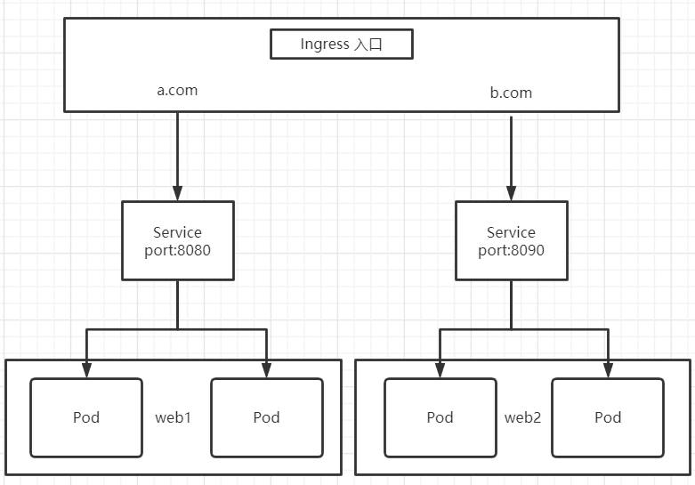

---
# 一、概述
在 K8s 的 Service 中我们说到, 因为每个 Pod 的 IP 是不固定的, 所以引入 Service 提供一组 Pod 的负载均衡, 通过把端口号对外暴露(type=NodePort), 使用 IP:Port 的方式进行访问

这样(type=NodePort)有一个缺陷, 在每一个节点上都会起端口, 在访问的时候通过任何节点, 通过该节点 IP:Port 访问, 这就意味着, 每个端口只能使用一次, 一个端口对应一个应用

在实际中, 都是通过域名访问, 根据不同域名跳转到不同的服务端口中.

# 二、Ingress 和 Pod 的关系
1. Pod 和 Ingress 通过 Service 关联的
2. Ingress 作为统一入口, 由 Service 关联一组 Pod

# 三、Ingress 工作流程



# 四、如何使用 Ingress
步骤一: 部署 Ingress Controller

步骤二: 创建 Ingress 规则


# 五、使用 Ingress 暴露 Nginx 应用
## 5.1 创建
创建 Nginx 应用, 对外暴露端口使用 NodePort
```bash
$ kubectl create deployment web --image=nginx
deployment.apps/web created

$ kubectl expose deployment web --port=80 --target-port=80 --type=NodePort
service/web exposed

$ kubectl get pod,svc
NAME                       READY   STATUS              RESTARTS   AGE
pod/web-5dcb957ccc-6vp68   0/1     ContainerCreating   0          28s

NAME                 TYPE        CLUSTER-IP      EXTERNAL-IP   PORT(S)        AGE
service/kubernetes   ClusterIP   10.96.0.1       <none>        443/TCP        9d
service/web          NodePort    10.104.91.244   <none>        80:30760/TCP   9s
```
## 5.2 部署
部署 Ingress Controller

1. 创建 ingress-con.yaml 文件
    ```bash
    $ vim ingress-con.yaml
    apiVersion: v1
    kind: Namespace
    metadata:
      name: ingress-nginx
      labels:
        app.kubernetes.io/name: ingress-nginx
        app.kubernetes.io/part-of: ingress-nginx
    
    ---
    
    kind: ConfigMap
    apiVersion: v1
    metadata:
      name: nginx-configuration
      namespace: ingress-nginx
      labels:
        app.kubernetes.io/name: ingress-nginx
        app.kubernetes.io/part-of: ingress-nginx
    
    ---
    kind: ConfigMap
    apiVersion: v1
    metadata:
      name: tcp-services
      namespace: ingress-nginx
      labels:
        app.kubernetes.io/name: ingress-nginx
        app.kubernetes.io/part-of: ingress-nginx
    
    ---
    kind: ConfigMap
    apiVersion: v1
    metadata:
      name: udp-services
      namespace: ingress-nginx
      labels:
        app.kubernetes.io/name: ingress-nginx
        app.kubernetes.io/part-of: ingress-nginx
    
    ---
    apiVersion: v1
    kind: ServiceAccount
    metadata:
      name: nginx-ingress-serviceaccount
      namespace: ingress-nginx
      labels:
        app.kubernetes.io/name: ingress-nginx
        app.kubernetes.io/part-of: ingress-nginx
    
    ---
    apiVersion: rbac.authorization.k8s.io/v1beta1
    kind: ClusterRole
    metadata:
      name: nginx-ingress-clusterrole
      labels:
        app.kubernetes.io/name: ingress-nginx
        app.kubernetes.io/part-of: ingress-nginx
    rules:
      - apiGroups:
          - ""
        resources:
          - configmaps
          - endpoints
          - nodes
          - pods
          - secrets
        verbs:
          - list
          - watch
      - apiGroups:
          - ""
        resources:
          - nodes
        verbs:
          - get
      - apiGroups:
          - ""
        resources:
          - services
        verbs:
          - get
          - list
          - watch
      - apiGroups:
          - ""
        resources:
          - events
        verbs:
          - create
          - patch
      - apiGroups:
          - "extensions"
          - "networking.k8s.io"
        resources:
          - ingresses
        verbs:
          - get
          - list
          - watch
      - apiGroups:
          - "extensions"
          - "networking.k8s.io"
        resources:
          - ingresses/status
        verbs:
          - update
    
    ---
    apiVersion: rbac.authorization.k8s.io/v1beta1
    kind: Role
    metadata:
      name: nginx-ingress-role
      namespace: ingress-nginx
      labels:
        app.kubernetes.io/name: ingress-nginx
        app.kubernetes.io/part-of: ingress-nginx
    rules:
      - apiGroups:
          - ""
        resources:
          - configmaps
          - pods
          - secrets
          - namespaces
        verbs:
          - get
      - apiGroups:
          - ""
        resources:
          - configmaps
        resourceNames:
          # Defaults to "<election-id>-<ingress-class>"
          # Here: "<ingress-controller-leader>-<nginx>"
          # This has to be adapted if you change either parameter
          # when launching the nginx-ingress-controller.
          - "ingress-controller-leader-nginx"
        verbs:
          - get
          - update
      - apiGroups:
          - ""
        resources:
          - configmaps
        verbs:
          - create
      - apiGroups:
          - ""
        resources:
          - endpoints
        verbs:
          - get
    
    ---
    apiVersion: rbac.authorization.k8s.io/v1beta1
    kind: RoleBinding
    metadata:
      name: nginx-ingress-role-nisa-binding
      namespace: ingress-nginx
      labels:
        app.kubernetes.io/name: ingress-nginx
        app.kubernetes.io/part-of: ingress-nginx
    roleRef:
      apiGroup: rbac.authorization.k8s.io
      kind: Role
      name: nginx-ingress-role
    subjects:
      - kind: ServiceAccount
        name: nginx-ingress-serviceaccount
        namespace: ingress-nginx
    
    ---
    apiVersion: rbac.authorization.k8s.io/v1beta1
    kind: ClusterRoleBinding
    metadata:
      name: nginx-ingress-clusterrole-nisa-binding
      labels:
        app.kubernetes.io/name: ingress-nginx
        app.kubernetes.io/part-of: ingress-nginx
    roleRef:
      apiGroup: rbac.authorization.k8s.io
      kind: ClusterRole
      name: nginx-ingress-clusterrole
    subjects:
      - kind: ServiceAccount
        name: nginx-ingress-serviceaccount
        namespace: ingress-nginx
    
    ---
    
    apiVersion: apps/v1
    kind: Deployment
    metadata:
      name: nginx-ingress-controller
      namespace: ingress-nginx
      labels:
        app.kubernetes.io/name: ingress-nginx
        app.kubernetes.io/part-of: ingress-nginx
    spec:
      replicas: 1
      selector:
        matchLabels:
          app.kubernetes.io/name: ingress-nginx
          app.kubernetes.io/part-of: ingress-nginx
      template:
        metadata:
          labels:
            app.kubernetes.io/name: ingress-nginx
            app.kubernetes.io/part-of: ingress-nginx
          annotations:
            prometheus.io/port: "10254"
            prometheus.io/scrape: "true"
        spec:
          hostNetwork: true
          # wait up to five minutes for the drain of connections
          terminationGracePeriodSeconds: 300
          serviceAccountName: nginx-ingress-serviceaccount
          nodeSelector:
            kubernetes.io/os: linux
          containers:
            - name: nginx-ingress-controller
              image: lizhenliang/nginx-ingress-controller:0.30.0
              args:
                - /nginx-ingress-controller
                - --configmap=$(POD_NAMESPACE)/nginx-configuration
                - --tcp-services-configmap=$(POD_NAMESPACE)/tcp-services
                - --udp-services-configmap=$(POD_NAMESPACE)/udp-services
                - --publish-service=$(POD_NAMESPACE)/ingress-nginx
                - --annotations-prefix=nginx.ingress.kubernetes.io
              securityContext:
                allowPrivilegeEscalation: true
                capabilities:
                  drop:
                    - ALL
                  add:
                    - NET_BIND_SERVICE
                # www-data -> 101
                runAsUser: 101
              env:
                - name: POD_NAME
                  valueFrom:
                    fieldRef:
                      fieldPath: metadata.name
                - name: POD_NAMESPACE
                  valueFrom:
                    fieldRef:
                      fieldPath: metadata.namespace
              ports:
                - name: http
                  containerPort: 80
                  protocol: TCP
                - name: https
                  containerPort: 443
                  protocol: TCP
              livenessProbe:
                failureThreshold: 3
                httpGet:
                  path: /healthz
                  port: 10254
                  scheme: HTTP
                initialDelaySeconds: 10
                periodSeconds: 10
                successThreshold: 1
                timeoutSeconds: 10
              readinessProbe:
                failureThreshold: 3
                httpGet:
                  path: /healthz
                  port: 10254
                  scheme: HTTP
                periodSeconds: 10
                successThreshold: 1
                timeoutSeconds: 10
              lifecycle:
                preStop:
                  exec:
                    command:
                      - /wait-shutdown
    
    ---
    
    apiVersion: v1
    kind: LimitRange
    metadata:
      name: ingress-nginx
      namespace: ingress-nginx
      labels:
        app.kubernetes.io/name: ingress-nginx
        app.kubernetes.io/part-of: ingress-nginx
    spec:
      limits:
      - min:
          memory: 90Mi
          cpu: 100m
        type: Container
    ```
2. 部署
    ```bash
    $ kubectl apply -f ingress-con.yaml 
    namespace/ingress-nginx created
    configmap/nginx-configuration created
    configmap/tcp-services created
    configmap/udp-services created
    serviceaccount/nginx-ingress-serviceaccount created
    clusterrole.rbac.authorization.k8s.io/nginx-ingress-clusterrole created
    role.rbac.authorization.k8s.io/nginx-ingress-role created
    rolebinding.rbac.authorization.k8s.io/nginx-ingress-role-nisa-binding created
    clusterrolebinding.rbac.authorization.k8s.io/nginx-ingress-clusterrole-nisa-binding created
    deployment.apps/nginx-ingress-controller created
    limitrange/ingress-nginx created
    ```
3. 查看 Ingress Controller 状态
    ```bash
    $ kubectl get pod -n ingress-nginx
    NAME                                       READY   STATUS    RESTARTS   AGE
    nginx-ingress-controller-766fb9f77-tgqt4   1/1     Running   0          42s
    ```
## 5.3 创建 Ingress 规则
1. 创建规则 Yaml 文件
    ```bash
    $ vim ingress-h.yaml
    apiVersion: networking.k8s.io/v1beta1
    kind: Ingress
    metadata:
      name: example-ingress
    spec:
      rules:
      - host: example.ingredemo.com
        http:
          paths:
          - path: /
            backend:
              serviceName: web
              servicePort: 80
    ```
2. 部署规则 Yaml 文件
    ```bash
    $ kubectl apply -f ingress-h.yaml 
    ingress.networking.k8s.io/example-ingress created
    ```
   
## 5.4 在浏览器中访问
```bash
$ kubectl get pods -n ingress-nginx -o wide
NAME                                       READY   STATUS    RESTARTS   AGE   IP                NODE        NOMINATED NODE   READINESS GATES
nginx-ingress-controller-766fb9f77-tgqt4   1/1     Running   0          11m   192.168.220.122   k8s-node1   <none>           <none>

$ kubectl get ingress
NAME              CLASS    HOSTS                   ADDRESS   PORTS   AGE
example-ingress   <none>   example.ingredemo.com             80      9m58s
```
在 window 的 Hosts 文件中添加一行 `<IP> HOSTS`, 例如我这是: `192.168.220.122 example.ingredemo.com`

在浏览器中输入: `example.ingredemo.com`, 即可访问到 Nginx 页面