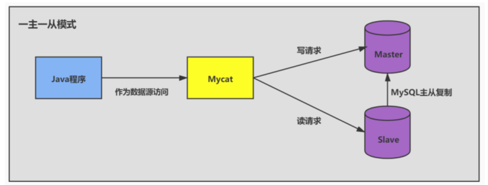

# 一、数据库调优的措施

## 1.1 调优的目标

- 尽可能 节省系统资源 ，以便系统可以提供更大负荷的服务。（吞吐量更大）

- 合理的结构设计和参数调整，以提高用户操作 响应的速度 。（响应速度更快）
- 减少系统的瓶颈，提高MySQL数据库整体的性能。

## 1.2 如何定位调优问题

不过随着用户量的不断增加，以及应用程序复杂度的提升，我们很难用“更快”去定义数据库调优的目标，因为用户在不同时间段访问服务器遇到的瓶颈不同，比如双十一促销的时候会带来大规模的并发访问;还有用户在进行不同业务操作的时候，数据库的事务处理和 SQL查询都会有所不同。因此我们还需要更加精细的定位，去确定调优的目标。


如何确定呢？一般情况下，有如下几种方式：

 

- 用户的反馈（主要）

  用户是我们的服务对象，因此他们的反馈是最直接的。虽然他们不会直接提出技术建议，但是有些问题往往是用户第一时间发现的。我们要重视用户的反馈，找到和数据相关的问题。

- 日志分析（主要）

  我们可以通过查看数据库日志和操作系统日志等方式找出异常情况，通过它们来定位遇到的问题。

- 服务器资源使用监控

  通过监控服务器的cPU、内存、Io等使用情况，可以实时了解服务器的性能使用，与历史情况进行对比

- 数据库内部状况监控

  在数据库的监控中，活动会话（Active Session)监控是一个重要的指标。通过它，你可以清楚地了解数据库当前是否处于非常繁忙的状态，是否存在SQL堆积等。

- 其它

  除了活动会话监控以外，我们也可以对 事务 、 锁等待 等进行监控，这些都可以帮助我们对数据库的运行状态有更全面的认识。

## 1.4 调优的维度和步骤 

我们需要调优的对象是整个数据库管理系统，它不仅包括 SQL 查询，还包括数据库的部署配置、架构等。从这个角度来说，我们思考的维度就不仅仅局限在 SQL 优化上了。通过如下的步骤我们进行梳理：

### 第1步：选择适合的 DBMS

如果对事务性处理以及安全性要求高的话，可以选择商业的数据库产品。这些数据库在事务处理和查询性能上都比较强，比如采用SQL Server、Oracle，那么单表存储上亿条数据是没有问题的。如果数据表设计得好，即使不采用分库分表的方式，查询效率也不差。


除此以外，你也可以采用开源的MysQL进行存储，它有很多存储引擎可以选择，如果进行事务处理的话可以选择lnnoDB，非事务处理可以选择MylSAM。


NoSQL_阵营包括键值型数据库、文档型数据库、搜索引擎、列式存储和图形数据库。这些数据库的优缺点和使用场景各有不同，比如列式存储数据库可以大幅度降低系统的I/o，适合于分布式文件系统，但如果数据需要频地增删改，那么列式存储就不太适用了。


DBMS的选择关系到了后面的整个设计过程，所以第一步就是要选择适合的DBMS。如果已经确定好了DBMS那么这步可以跳过。


### 第2步：优化表设计

选择了DBMS之后，我们就需要进行表设计了。而数据表的设计方式也直接影响了后续的SQL查询语句。RDBMS中，每个对象都可以定义为一张表，表与表之间的关系代表了对象之间的关系。如果用的是MySQL，我们还可以根据不同表的使用需求，选择不同的存储引擎。除此以外，还有一些优化的原则可以参考:

1. 表结构要尽量遵循三范式的原则。这样可以让数据结构更加清晰规范，减少冗余字段，同时也减少了在更新，插入和删除数据时等异常情况的发生。

2. 如果查询应用比较多，尤其是需要进行多表联查的时候，可以采用反范式进行优化。反范式采用空间换时间的方式，通过增加冗余字段提高查询的效率。
3. 表字段的数据类型选择，关系到了查询效率的高低以及存储空间的大小。一般来说，如果字段可以采用数值类型就不要采用字符类型;字符长度要尽可能设计得短一些。针对字符类型来说，当确定字符长度固定时就可以采用CHAR类型;当长度不固定时，通常采用VARCHAR类型。

数据表的结构设计很基础，也很关键。好的表结构可以在业务发展和用户量增加的情况下依然发挥作用，不好的表结构设计会让数据表变得非常臃肿，查询效率也会降低。

### 第3步：优化逻辑查询

当我们建立好数据表之后，就可以对数据表进行增删改查的操作了。这时我们首先需要考虑的是逻辑查询优化。SQL查询优化，可以分为逻辑查询优化和物理查询优化。逻辑查询优化就是通过改变SQL语句的内容让SQL执行效率更高效，采用的方式是对SQL语句进行等价变换，对查询进行重写。


SQL的查询重写包括了子查询优化、等价谓词重写、视图重写、条件简化、连接消除和嵌套连接消除等。


比如我们在讲解EXISTS子查询和IN子查询的时候，会根据小表驱动大表的原则选择适合的子查询。在WHERE子句中会尽量避免对字段进行函数运算，它们会让字段的索引失效。


举例:查询评论内容开头为abc的内容都有哪些，如果在WHERE子句中使用了函数，语句就会写成下面这样

```sql
SELECT comment_id，comment_text，comment_time FROM product_comment 
WHERE SUBSTRING ( comment_text, 1,3)= 'abc'
```

采用查询重写的方式进行等价替换:

```sql
SELECT comment_id，comment_text,comment_time FROM product_comment 
WHERE comment_text LIKE 'abc%'
```

### 第4步：优化物理查询

物理查询优化是在确定了逻辑查询优化之后，采用物理优化技术（比如索引等），通过计算代价模型对各种可能的访问路径进行估算，从而找到执行方式中代价最小的作为执行计划。在这个部分中，我们需要掌握的重点是对索引的创建和使用。


但索引不是万能的，我们需要根据实际情况来创建索引。那么都有哪些情况需要考虑呢?我们在前面几章中已经进行了细致的剖析。


SQL查询时需要对不同的数据表进行查询，因此在物理查询优化阶段也需要确定这些查询所采用的路径，具体的情况包括:

1. 单表扫描:对于单表扫描来说，我们可以全表扫描所有的数据，也可以局部扫描。
2. 两张表的连接:常用的连接方式包括了嵌套循环连接、HASH 连接和合并连接。
3. 多张表的连接∶多张数据表进行连接的时候，顺序很重要，因为不同的连接路径查询的效率不同，搜索空间也会不同。我们在进行多表连接的时候，搜索空间可能会达到很高的数据量级，巨大的搜索空间显然会占用更多的资源，因此我们需要通过调整连接顺序，将搜索空间调整在一个可接受的范围内。

### 第5步：使用 Redis 或 Memcached 作为缓存

除了可以对 SQL 本身进行优化以外，我们还可以请外援提升查询的效率。


因为数据都是存放到数据库中，我们需要从数据库层中取出数据放到内存中进行业务逻辑的操作，当用户量增大的时候，如果频繁地进行数据查询，会消耗数据库的很多资源。如果我们将常用的数据直接放到内存中，就会大幅提升查询的效率。


键值存储数据库可以帮我们解决这个问题。


常用的键值存储数据库有 Redis 和 Memcached，它们都可以将数据存放到内存中。


从可靠性来说, Redis支持持久化，可以让我们的数据保存在硬盘上，不过这样一来性能消耗也会比较大。而Memcached 仅仅是内存存储，不支持持久化。


从支持的数据类型来说，Redis 比Memcached要多，它不仅支持 key-value类型的数据，还支持List，Set,Hash等数据结构。当我们有持久化需求或者是更高级的数据处理需求的时候，就可以使用Redis。如果是简单的key-value存储，则可以使用Memcached。


通常我们对于查询响应要求高的场景（响应时间短，吞吐量大)，可以考虑内存数据库，毕竟术业有专攻。传统的 RDBMS都是将数据存储在硬盘上，而内存数据库则存放在内存中，查询起来要快得多。不过使用不同的工具，也增加了开发人员的使用成本。


### 第6步：库级优化

库级优化是站在数据库的维度上进行的优化策略，比如控制一个库中的数据表数量。另外，单一的数据库总会遇到各种限制，不如取长补短，利用"外援的方式。通过主从架构优化我们的读写策略，通过对数据库进行垂直或者水平切分，突破单一数据库或数据表的访问限制，提升查询的性能。


**1、读写分离**

如果读和写的业务量都很大，并且它们都在同一个数据库服务器中进行操作，那么数据库的性能就会出现瓶颈，这时为了提升系统的性能，优化用户体验，我们可以采用读写分离的方式降低主数据库的负载，比如用主数据库( master)完成写操作，用从数据库(slave）完成读操作。




**2、数据分片**

对数据库分库分表。当数据量级达到千万级以上时，有时候我们需要把一个数据库切成多份，放到不同的数据库服务器上，减少对单一数据库服务器的访问压力。如果你使用的是MySQL，就可以使用MysQL自带的分区表功能，当然你也可以考虑自己做垂直拆分（分库）、水平拆分（分表）、垂直+水平拆分(分库分表)。


# 三、优化MySQL服务器

优化MysQL服务器主要从两个方面来优化，一方面是对硬件进行优化;另一方面是对MySQL服务的参数进行优化。这部分的内容需要较全面的知识，一般只有专业的数据库管理员才能进行这一类的优化。对于可以定制参数的操作系统，也可以针对MySQL进行操作系统优化。


## 2.1 优化服务器硬件

服务器的硬件性能直接决定着MySQL数据库的性能。硬件的性能瓶颈直接决定MySQL数据库的运行速度和效率。针对性能瓶颈提高硬件配置，可以提高MySQL数据库查询、更新的速度。


(1）配置较大的内存。足够大的内存是提高MysQL数据库性能的方法之一。内存的速度比磁盘I/O快得多，可以通过增加系统的缓冲区容量使数据在内存中停留的时间更长，以减少磁盘I/0。

(2）配置高速磁盘系统，以减少读盘的等待时间，提高响应速度。磁盘的I/O能力，也就是它的寻道能力，目前的SCSI高速旋转的是7200转/分钟，这样的速度，一旦访问的用户量上去，磁盘的压力就会过大，如果是每天的网站pv(page view)在150w，这样的一般的配置就无法满足这样的需求了。现在SSD盛行，在SSD上随机访问和顺序访问性能几乎差不多，使用SSD可以减少随机Io带来的性能损耗。

(3)合理分布磁盘I/0，把磁盘I/0分散在多个设备上，以减少资源竞争，提高并行操作能力。

(4）配置多处理器，MySQL是多线程的数据库，多处理器可同时执行多个线程。


