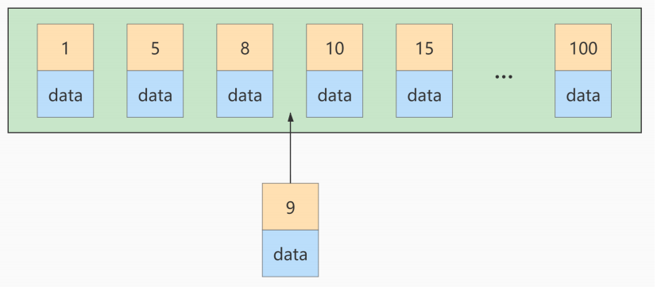
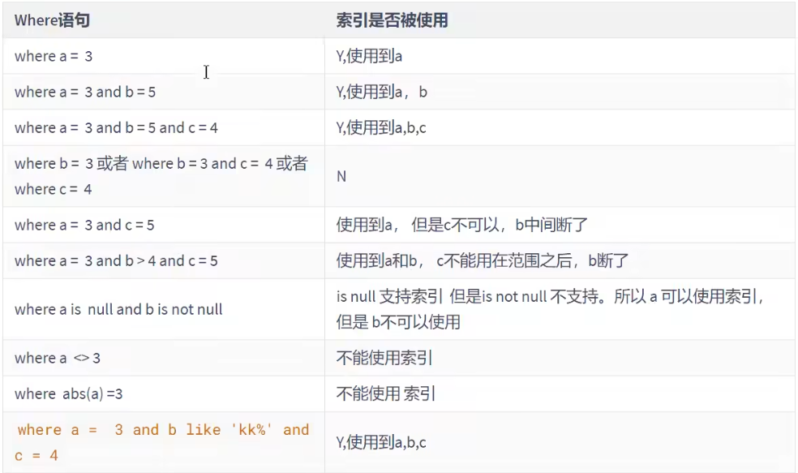
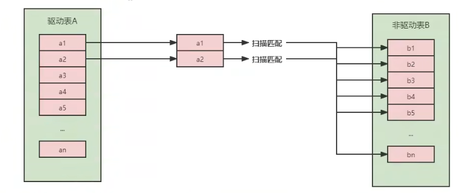
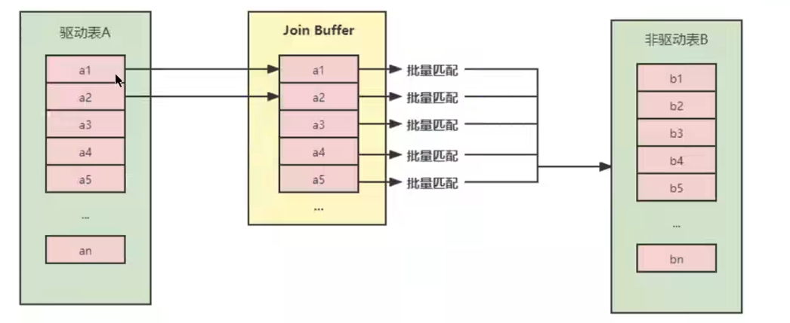
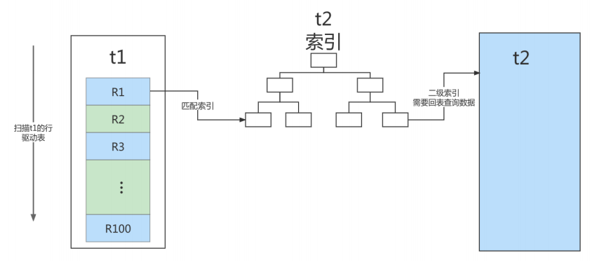

---
都有哪些维度可以进行数据库调优?简言之:
1. 索引失效、没有充分利用到索引――索引建立
2. 关联查询太多JOIN(设计缺陷或不得已的需求)——SQL优化
3. 服务器调优及各个参数设置(缓冲、线程数等)――调整my.cnf
4. 数据过多一分库分表

关于数据库调优的知识点非常分散。不同的DBMS，不同的公司，不同的职位，不同的项目遇到的问题都不尽相同。这里我们分为三个章节进行细致讲解。

虽然SQL查询优化的技术有很多，但是大方向上完全可以分成物理查询优化和逻辑查询优化两大块。

- 物理查询优化是通过索引和表连接方式等技术来进行优化，这里重点需要掌握索引的使用。
- 逻辑查询优化就是通过SQL等价变换提升查询效率，直白一点就是说，换一种查询写法执行效率可能更高。


# 一、数据准备
学员表 插 50万 条， 班级表 插 1万 条。

## 步骤1：建表
```mysql
CREATE TABLE `class` ( 
	`id` INT(11) NOT NULL AUTO_INCREMENT, 
	`className` VARCHAR(30) DEFAULT NULL, 
	`address` VARCHAR(40) DEFAULT NULL, 
	`monitor` INT NULL , PRIMARY KEY (`id`) 
) ENGINE=INNODB AUTO_INCREMENT=1 DEFAULT CHARSET=utf8; 

CREATE TABLE `student` ( 
	`id` INT(11) NOT NULL AUTO_INCREMENT, 
	`stuno` INT NOT NULL , 
	`name` VARCHAR(20) DEFAULT NULL, 
	`age` INT(3) DEFAULT NULL, 
	`classId` INT(11) DEFAULT NULL, 
	PRIMARY KEY (`id`) 
#CONSTRAINT `fk_class_id` FOREIGN KEY (`classId`) REFERENCES `t_class` (`id`) 
) ENGINE=INNODB AUTO_INCREMENT=1 DEFAULT CHARSET=utf8;
```
## 步骤2：设置参数
命令开启：允许创建函数设置：
```mysql
set global log_bin_trust_function_creators=1; # 不加global只是当前窗口有效。
```
## 步骤3：创建函数
保证每条数据都不同。
```mysql
#随机产生字符串 
DELIMITER // 
CREATE FUNCTION rand_string(n INT) RETURNS VARCHAR(255) 
BEGIN 
DECLARE chars_str VARCHAR(100) DEFAULT
 'abcdefghijklmnopqrstuvwxyzABCDEFJHIJKLMNOPQRSTUVWXYZ'; 
DECLARE return_str VARCHAR(255) DEFAULT ''; 
DECLARE i INT DEFAULT 0; 
WHILE i < n DO 
SET return_str =CONCAT(return_str,SUBSTRING(chars_str,FLOOR(1+RAND()*52),1)); 
SET i = i + 1; 
END WHILE;
RETURN return_str; 
END // 
DELIMITER ; 

#假如要删除 
#drop function rand_string;
```
随机产生班级编号
```mysql
#用于随机产生多少到多少的编号 
DELIMITER // 
CREATE FUNCTION rand_num (from_num INT ,to_num INT) RETURNS INT(11) 
BEGIN 
DECLARE i INT DEFAULT 0; SET i = FLOOR(from_num +RAND()*(to_num - from_num+1)) ; 
RETURN i; 
END // 
DELIMITER ; 

#假如要删除 
#drop function rand_num;
```
## 步骤4：创建存储过程
```mysql
#创建往stu表中插入数据的存储过程 
DELIMITER // 
CREATE PROCEDURE insert_stu( START INT , max_num INT ) 
BEGIN 
DECLARE i INT DEFAULT 0; 
SET autocommit = 0; #设置手动提交事务 
REPEAT #循环 
SET i = i + 1; #赋值 
INSERT INTO student (stuno, name ,age ,classId ) VALUES ((START+i),rand_string(6),rand_num(1,50),rand_num(1,1000)); 
UNTIL i = max_num END REPEAT; 
COMMIT; #提交事务 
END // 
DELIMITER ; 

#假如要删除 
#drop PROCEDURE insert_stu;
```
创建往class表中插入数据的存储过程
```mysql
#执行存储过程，往class表添加随机数据 
DELIMITER // 
CREATE PROCEDURE `insert_class`( max_num INT ) BEGIN DECLARE i INT DEFAULT 0; 
SET autocommit = 0; 
REPEAT 
SET i = i + 1; 
INSERT INTO class ( classname,address,monitor ) VALUES
 (rand_string(8),rand_string(10),rand_num(1,100000)); 
UNTIL i = max_num 
END REPEAT; 
COMMIT;
END // 
DELIMITER ; 

#假如要删除 
#drop PROCEDURE insert_class;
```
## 步骤5：调用存储过程
```mysql
-- class
# 执行存储过程，往class表添加11万条数据 
CALL insert_class(110000);

-- stu
#执行存储过程，往stu表添加400万条数据 
CALL insert_stu(1000000,5000000);
```
## 步骤6：删除某表上的索引
创建存储过程
```mysql
DELIMITER // 
CREATE PROCEDURE `proc_drop_index`(dbname VARCHAR(200),tablename VARCHAR(200)) 
BEGIN 
DECLARE done INT DEFAULT 0; 
DECLARE ct INT DEFAULT 0; 
DECLARE _index VARCHAR(200) DEFAULT ''; 
DECLARE _cur CURSOR FOR SELECT index_name FROM 
information_schema.STATISTICS WHERE table_schema=dbname AND 
table_name=tablename AND seq_in_index=1 AND index_name <>'PRIMARY' ; 
#每个游标必须使用不同的declare continue handler for not found set done=1来控制游标的结束 
DECLARE CONTINUE HANDLER FOR NOT FOUND set done=2 ; 
#若没有数据返回,程序继续,并将变量done设为2 
OPEN _cur; 
FETCH _cur INTO _index; 
WHILE _index<>'' DO 
SET @str = CONCAT("drop index " , _index , " on " , tablename ); 
PREPARE sql_str FROM @str ; 
EXECUTE sql_str; 
DEALLOCATE PREPARE sql_str; 
SET _index=''; 
FETCH _cur INTO _index; 
END WHILE; 
CLOSE _cur; 
END // 
DELIMITER ;
```
执行存储过程
```mysql
CALL proc_drop_index("dbname","tablename");
```

# 二、索引失效案例
MySQL中提高性能的一个最有效的方式是对数据表设计合理的索引。索引提供了高效访问数据的方法，并且加快查询的速度，因此索引对查询的速度有着至关重要的影响。

- 使用索引可以快速地定位表中的某条记录，从而提高数据库查询的速度，提高数据库的性能。
- 如果查询时没有使用索引，查询语句就会扫描表中的所有记录。在数据量大的情况下，这样查询的速度会很慢。

大多数情况下都（默认）采用B+树来构建索引。只是空间列类型的索引使用R-树，并且MEMORY表还支持hash索引。

其实，用不用索引，最终都是优化器说了算。优化器是基于什么的优化器?基于cost开销(CostBaseOptimizer)，它不是基于规则(Rule-BasedOptimizer)，也不是基于语义。怎么样开销小就怎么来。另外，SQL语句是否使用索引，跟数据库版本、数据量、数据选择度都有关系。

## 2.1 全值匹配我最爱
系统中经常出现的sql语句如下:
```mysql
EXPLAIN SELECT SQL_NO_CACHE * FROM student WHERE age=30;
EXPLAIN SELECT SQL_NO_CACHE * FROM student WHERE age=30 and classId=4;
EXPLAIN SELECT SQL_NO_CACHE * FROM student WHERE age=30 and classId=4 AND name = 'abcd' ;
```
建立索引前执行:(关注执行时间)
```mysql
mysql> SELECT SQL_NO_CACHE * FROM student WHERE age=30 and classId=4 AND name = 'abcd ';
Empty set,1 warning (0.28 sec)
```
建立索引
```mysql
CREATE INDEX idx_age oN student( age ) ;
CREATE INDEX idx_age_classid ON student(age , classId );
CREATE INDEX idx_age_classid_name ON student( age ,classId , name ) ;
```
建立索引后执行:
```mysql
mysql> SELECT SQL_NO_CACHE * FROM student WHERE age=30 and classId=4 AND name = 'abcd ';
Empty set,1 warning (0.01 sec)
```
可以看到，创建索引前的查询时间是0.28秒，创建索引后的查询时间是0.01秒，索引帮助我们极大的提高了查询效率。

## 2.2 最佳左前缀法则
在MySQL建立联合索引时会遵守最佳左前缀匹配原则，即最左优先，在检索数据时从联合索引的最左边开始匹配。

举例1:
```mysql
mysql> EXPLAIN SELECT SQL_NO_CACHE * FROM student WHERE student.age=30 AND student.name = 'abcd' ;
+----+-------------+---------+------------+------+----------------------------------------------+----------------------+---------+-------+-------+----------+-----------------------+
| id | select_type | table   | partitions | type | possible_keys                                | key                  | key_len | ref   | rows  | filtered | Extra                 |
+----+-------------+---------+------------+------+----------------------------------------------+----------------------+---------+-------+-------+----------+-----------------------+
|  1 | SIMPLE      | student | NULL       | ref  | idx_age_classid_name,idx_age,idx_age_classid | idx_age_classid_name | 5       | const | 81778 |    10.00 | Using index condition |
+----+-------------+---------+------------+------+----------------------------------------------+----------------------+---------+-------+-------+----------+-----------------------+
1 row in set, 2 warnings (0.00 sec)
```
举例2:
```mysql
mysql> EXPLAIN SELECT SQL_NO_CACHE * FROM student WHERE student.classid=1 AND student.name = 'abcd';
+----+-------------+---------+------------+------+---------------+------+---------+------+---------+----------+-------------+
| id | select_type | table   | partitions | type | possible_keys | key  | key_len | ref  | rows    | filtered | Extra       |
+----+-------------+---------+------------+------+---------------+------+---------+------+---------+----------+-------------+
|  1 | SIMPLE      | student | NULL       | ALL  | NULL          | NULL | NULL    | NULL | 3990115 |     1.00 | Using where |
+----+-------------+---------+------------+------+---------------+------+---------+------+---------+----------+-------------+
1 row in set, 2 warnings (0.00 sec)
```
举例3:索引idx_age_classid_name还能否正常使用?
```mysql
mysql> EXPLAIN SELECT SQL_NO_CACHE * FROM student WHERE classid=4 AND student.age=30 AND student.name= 'abcd';
+----+-------------+---------+------------+------+----------------------------------------------+----------------------+---------+-------------------+------+----------+-------+
| id | select_type | table   | partitions | type | possible_keys                                | key                  | key_len | ref               | rows | filtered | Extra |
+----+-------------+---------+------------+------+----------------------------------------------+----------------------+---------+-------------------+------+----------+-------+
|  1 | SIMPLE      | student | NULL       | ref  | idx_age_classid_name,idx_age,idx_age_classid | idx_age_classid_name | 73      | const,const,const |    1 |   100.00 | NULL  |
+----+-------------+---------+------------+------+----------------------------------------------+----------------------+---------+-------------------+------+----------+-------+
1 row in set, 2 warnings (0.00 sec)
```
> 注意: where 条件的 classid、age、name 可以交换顺序，在优化器中会重新排列。

如果索引了多列，要遵守最左前缀法则。指的是查询从索引的最左前列开始并且不跳过索引中的列。
```mysql
mysql> EXPLAIN SELECT SQL_NO_CACHE * FROM student WHERE student.age=30 AND student.name ='abcd';
+----+-------------+---------+------------+------+----------------------------------------------+----------------------+---------+-------+-------+----------+-----------------------+
| id | select_type | table   | partitions | type | possible_keys                                | key                  | key_len | ref   | rows  | filtered | Extra                 |
+----+-------------+---------+------------+------+----------------------------------------------+----------------------+---------+-------+-------+----------+-----------------------+
|  1 | SIMPLE      | student | NULL       | ref  | idx_age_classid_name,idx_age,idx_age_classid | idx_age_classid_name | 5       | const | 81778 |    10.00 | Using index condition |
+----+-------------+---------+------------+------+----------------------------------------------+----------------------+---------+-------+-------+----------+-----------------------+
1 row in set, 2 warnings (0.00 sec)
```
虽然可以正常使用，但是只有部分被使用到了。

```mysql
mysql> EXPLAIN SELECT SQL_NO_CACHE * FROM student WHERE student.classid=1 AND student.name ='abcd ' ;
+----+-------------+---------+------------+------+---------------+------+---------+------+---------+----------+-------------+
| id | select_type | table   | partitions | type | possible_keys | key  | key_len | ref  | rows    | filtered | Extra       |
+----+-------------+---------+------------+------+---------------+------+---------+------+---------+----------+-------------+
|  1 | SIMPLE      | student | NULL       | ALL  | NULL          | NULL | NULL    | NULL | 3990115 |     1.00 | Using where |
+----+-------------+---------+------------+------+---------------+------+---------+------+---------+----------+-------------+
1 row in set, 2 warnings (0.00 sec)
```
此时，完全没有使用上索引。

> 结论:MySQL可以为多个字段创建索引，一个索引可以包括16个字段。对于多列索引，过滤条件要使用索引必须按照索引建立时的顺序，依次满足，一旦跳过某个字段，索引后面的字段都无法被使用。如果查询条件中没有使用这些字段中第1个字段时，多列(或联合)索引不会被使用。

> 拓展：Alibaba《Java开发手册》: 索引文件具有 B-Tree 的最左前缀匹配特性，如果左边的值未确定，那么无法使用此索引。

## 2.3 主键插入顺序
对于一个使用InnoDB存储引擎的表来说，在我们没有显式的创建索引时，表中的数据实际上都是存储在聚簇索引的叶子节点的。而记录又是存储在数据页中的，数据页和记录又是按照记录主键值从小到大的顺序进行排序，所以如果我们插入的记录的主键值是依次增大的话，那我们每插满一个数据页就换到下一个数据页继续插，而如果我们插入的主键值忽大忽小的话，就比较麻烦了，假设某个数据页存储的记录已经满了，它存储的主键值在1~100之间:


如果此时再插入一条主键值为 9 的记录，那它插入的位置就如下图：



可这个数据页已经满了，再插进来咋办呢？我们需要把当前 页面分裂 成两个页面，把本页中的一些记录移动到新创建的这个页中。页面分裂和记录移位意味着什么？意味着： 性能损耗 ！所以如果我们想尽量避免这样无谓的性能损耗，最好让插入的记录的 主键值依次递增 ，这样就不会发生这样的性能损耗了。

所以我们建议：让主键具有 AUTO_INCREMENT ，让存储引擎自己为表生成主键，而不是我们手动插入 ，比如： person_info 表：
```mysql
CREATE TABLE person_info( 
	id INT UNSIGNED NOT NULL AUTO_INCREMENT, 
	name VARCHAR(100) NOT NULL, 
	birthday DATE NOT NULL, 
	phone_number CHAR(11) NOT NULL, 
	country varchar(100) NOT NULL, 
	PRIMARY KEY (id), 
	KEY idx_name_birthday_phone_number (name(10), 
	birthday, phone_number) 
);
```
我们自定义的主键列 id 拥有 AUTO_INCREMENT 属性，在插入记录时存储引擎会自动为我们填入自增的主键值。这样的主键占用空间小，顺序写入，减少页分裂。

## 2.4 计算、函数、类型转换(自动或手动)导致索引失效
这两条sql哪种写法更好
```mysql
EXPLAIN SELECT SQL_NO_CACHE * FROM student WHERE student.name LIKE 'abc%';
and
EXPLAIN SELECT SQL_NO_CACHE * FROM student WHERE LEFT(student.name,3) = 'abc';
```
创建索引
```mysql
CREATE INDEX idx_name ON student(NAME);
```
第一种：索引优化生效
```mysql
mysql> EXPLAIN SELECT SQL_NO_CACHE * FROM student WHERE student.name LIKE 'abc%';
+----+-------------+---------+------------+-------+---------------+----------+---------+------+------+----------+-----------------------+
| id | select_type | table   | partitions | type  | possible_keys | key      | key_len | ref  | rows | filtered | Extra                 |
+----+-------------+---------+------------+-------+---------------+----------+---------+------+------+----------+-----------------------+
|  1 | SIMPLE      | student | NULL       | range | idx_name      | idx_name | 63      | NULL |  181 |   100.00 | Using index condition |
+----+-------------+---------+------------+-------+---------------+----------+---------+------+------+----------+-----------------------+
1 row in set, 2 warnings (0.00 sec)
```
```mysql
mysql> SELECT SQL_NO_CACHE * FROM student WHERE student.name LIKE 'abc%';
181 rows in set, 1 warning (0.00 sec)
```
第二种：索引优化失效
```mysql
mysql> EXPLAIN SELECT SQL_NO_CACHE * FROM student WHERE LEFT(student.name,3) = 'abc';
+----+-------------+---------+------------+------+---------------+------+---------+------+---------+----------+-------------+
| id | select_type | table   | partitions | type | possible_keys | key  | key_len | ref  | rows    | filtered | Extra       |
+----+-------------+---------+------------+------+---------------+------+---------+------+---------+----------+-------------+
|  1 | SIMPLE      | student | NULL       | ALL  | NULL          | NULL | NULL    | NULL | 3990115 |   100.00 | Using where |
+----+-------------+---------+------------+------+---------------+------+---------+------+---------+----------+-------------+
1 row in set, 2 warnings (0.00 sec)
```
```mysql
mysql> SELECT SQL_NO_CACHE * FROM student WHERE LEFT(student.name,3) = 'abc';
```
type为“ALL”，表示没有使用到索引，查询时间为 3.62 秒，查询效率较之前低很多。

再举例：

student表的字段stuno上设置有索引
```mysql
CREATE INDEX idx_sno ON student(stuno);
```
**索引优化失效**:
```mysql
mysql> EXPLAIN SELECT SQL_NO_CACHE id, stuno, NAME FROM student WHERE stuno+1 = 900001;
+----+-------------+---------+------------+------+---------------+------+---------+------+---------+----------+-------------+
| id | select_type | table   | partitions | type | possible_keys | key  | key_len | ref  | rows    | filtered | Extra       |
+----+-------------+---------+------------+------+---------------+------+---------+------+---------+----------+-------------+
|  1 | SIMPLE      | student | NULL       | ALL  | NULL          | NULL | NULL    | NULL | 3990115 |   100.00 | Using where |
+----+-------------+---------+------------+------+---------------+------+---------+------+---------+----------+-------------+
1 row in set, 2 warnings (0.00 sec)
```
你能看到如果对索引进行了表达式计算，索引就失效了。这是因为我们需要把索引字段的取值都取出来，然后依次进行表达式的计算来进行条件判断，因此采用的就是全表扫描的方式，运行时间也会慢很多，最终运行时间为2.538秒。

**索引优化生效**：
```mysql
mysql> EXPLAIN SELECT SQL_NO_CACHE id, stuno, NAME FROM student WHERE stuno = 900000;
+----+-------------+---------+------------+------+---------------+---------+---------+-------+------+----------+-------+
| id | select_type | table   | partitions | type | possible_keys | key     | key_len | ref   | rows | filtered | Extra |
+----+-------------+---------+------------+------+---------------+---------+---------+-------+------+----------+-------+
|  1 | SIMPLE      | student | NULL       | ref  | idx_sno       | idx_sno | 4       | const |    1 |   100.00 | NULL  |
+----+-------------+---------+------------+------+---------------+---------+---------+-------+------+----------+-------+
1 row in set, 2 warnings (0.00 sec)
```
运行时间为0.039秒。

再举例：

student表的字段name上设置有索引
```mysql
CREATE INDEX idx_name ON student(NAME);
```
我们想要对name的前三位为abc的内容进行条件筛选，这里我们来查看下执行计划:

索引优化失效:
```mysql
mysql> EXPLAIN SELECT id, stuno, name FROM student WHERE SUBSTRING(name, 1,3)='abc';
+----+-------------+---------+------------+------+---------------+------+---------+------+---------+----------+-------------+
| id | select_type | table   | partitions | type | possible_keys | key  | key_len | ref  | rows    | filtered | Extra       |
+----+-------------+---------+------------+------+---------------+------+---------+------+---------+----------+-------------+
|  1 | SIMPLE      | student | NULL       | ALL  | NULL          | NULL | NULL    | NULL | 3990115 |   100.00 | Using where |
+----+-------------+---------+------------+------+---------------+------+---------+------+---------+----------+-------------+
1 row in set, 1 warning (0.00 sec)
```
索引优化生效:
```mysql
mysql> EXPLAIN SELECT id, stuno, NAME FROM student WHERE NAME LIKE 'abc%';
+----+-------------+---------+------------+-------+---------------+----------+---------+------+------+----------+-----------------------+
| id | select_type | table   | partitions | type  | possible_keys | key      | key_len | ref  | rows | filtered | Extra                 |
+----+-------------+---------+------------+-------+---------------+----------+---------+------+------+----------+-----------------------+
|  1 | SIMPLE      | student | NULL       | range | idx_name      | idx_name | 63      | NULL |  181 |   100.00 | Using index condition |
+----+-------------+---------+------------+-------+---------------+----------+---------+------+------+----------+-----------------------+
1 row in set, 1 warning (0.00 sec)
```
你能看到经过查询重写后，可以使用索引进行范围检索，从而提升查询效率。

## 2.5 类型转换导致索引失效
下列哪个sql语句可以用到索引。（假设name字段上设置有索引）
```mysql
# 未使用到索引 
mysql> EXPLAIN SELECT SQL_NO_CACHE * FROM student WHERE name=123;
+----+-------------+---------+------------+------+---------------+------+---------+------+---------+----------+-------------+
| id | select_type | table   | partitions | type | possible_keys | key  | key_len | ref  | rows    | filtered | Extra       |
+----+-------------+---------+------------+------+---------------+------+---------+------+---------+----------+-------------+
|  1 | SIMPLE      | student | NULL       | ALL  | idx_name      | NULL | NULL    | NULL | 3990115 |    10.00 | Using where |
+----+-------------+---------+------------+------+---------------+------+---------+------+---------+----------+-------------+
1 row in set, 5 warnings (0.00 sec)

# 使用到索引 
mysql> EXPLAIN SELECT SQL_NO_CACHE * FROM student WHERE name='123';
+----+-------------+---------+------------+------+---------------+----------+---------+-------+------+----------+-------+
| id | select_type | table   | partitions | type | possible_keys | key      | key_len | ref   | rows | filtered | Extra |
+----+-------------+---------+------------+------+---------------+----------+---------+-------+------+----------+-------+
|  1 | SIMPLE      | student | NULL       | ref  | idx_name      | idx_name | 63      | const |    1 |   100.00 | NULL  |
+----+-------------+---------+------------+------+---------------+----------+---------+-------+------+----------+-------+
1 row in set, 2 warnings (0.00 sec)
```
name=123发生类型转换，索引失效。
> 结论:设计实体类属性时，一定要与数据库字段类型相对应。否则，就会出现类型转换的情况。


## 2.6 范围条件右边的列索引失效

如果系统经常出现的sql如下:
```mysql
ALTER TABLE student DROP INDEX idx_name; 
ALTER TABLE student DROP INDEX idx_age; 
ALTER TABLE student DROP INDEX idx_age_classid;

mysql> EXPLAIN SELECT SQL_NO_CACHE * FROM student WHERE student.age=30 AND student.classId>20 AND student.name = 'abc' ;
+----+-------------+---------+------------+-------+----------------------+----------------------+---------+------+-------+----------+----------------------------------+
| id | select_type | table   | partitions | type  | possible_keys        | key                  | key_len | ref  | rows  | filtered | Extra                            |
+----+-------------+---------+------------+-------+----------------------+----------------------+---------+------+-------+----------+----------------------------------+
|  1 | SIMPLE      | student | NULL       | range | idx_age_classid_name | idx_age_classid_name | 10      | NULL | 83068 |    10.00 | Using index condition; Using MRR |
+----+-------------+---------+------------+-------+----------------------+----------------------+---------+------+-------+----------+----------------------------------+
1 row in set, 2 warnings (0.00 sec)
```
可以看到, ken_len 是 10, 原因是 age、classid 用到了索引，name 没有用到索引，age和classid为 int 类型的字段占4个字节，且可以为NULL占1个字节，加起来就是10字节。如果name用到了索引，那应该加上 name 占的63字节(varchar占3字节，varchar是可变的占2字节，name是可以为NULL的占用1字节)，三个字段都用到索引后，key_len的总大小应该是73。

那么索引 idx_age_classid_name 就不能正常使用了(name 未使用到索引)。

> 结论: 范围右边的列不能使用。比如: (<) (<=) (>)(>=）和between等。

如果这种sql出现较多，应该建立:
```mysql
create index idx_age_name_classid on student(age,name,classid);
```
将范围查询条件放置语句最后：
```mysql
mysql> EXPLAIN SELECT SQL_NO_CACHE * FROM student WHERE student.age=30 AND student.name = 'abc' AND student.classId>20 ;
+----+-------------+---------+------------+-------+-------------------------------------------+----------------------+---------+------+------+----------+-----------------------+
| id | select_type | table   | partitions | type  | possible_keys                             | key                  | key_len | ref  | rows | filtered | Extra                 |
+----+-------------+---------+------------+-------+-------------------------------------------+----------------------+---------+------+------+----------+-----------------------+
|  1 | SIMPLE      | student | NULL       | range | idx_age_classid_name,idx_age_name_classid | idx_age_name_classid | 73      | NULL |    1 |   100.00 | Using index condition |
+----+-------------+---------+------------+-------+-------------------------------------------+----------------------+---------+------+------+----------+-----------------------+
1 row in set, 2 warnings (0.00 sec)
```
> 应用开发中范围查询，例如:金额查询，日期查询往往都是范围查询。应将查询条件放置where语句最后。

## 2.7 不等于(!= 或者<>)索引失效
为name字段创建索引
```mysql
CREATE INDEX idx_name oN student(NAME);
```
查看索引是否失效
```mysql
mysql> EXPLAIN SELECT SQL_NO_CACHE * FROM student WHERE student.name <> 'abc' ;
+----+-------------+---------+------------+------+---------------+------+---------+------+---------+----------+-------------+
| id | select_type | table   | partitions | type | possible_keys | key  | key_len | ref  | rows    | filtered | Extra       |
+----+-------------+---------+------------+------+---------------+------+---------+------+---------+----------+-------------+
|  1 | SIMPLE      | student | NULL       | ALL  | idx_name      | NULL | NULL    | NULL | 3990115 |    50.15 | Using where |
+----+-------------+---------+------------+------+---------------+------+---------+------+---------+----------+-------------+
1 row in set, 2 warnings (0.00 sec)
```
或者
```mysql
mysql> EXPLAIN SELECT SQL_NO_CACHE * FROM student WHERE student. name != 'abc';
+----+-------------+---------+------------+------+---------------+------+---------+------+---------+----------+-------------+
| id | select_type | table   | partitions | type | possible_keys | key  | key_len | ref  | rows    | filtered | Extra       |
+----+-------------+---------+------------+------+---------------+------+---------+------+---------+----------+-------------+
|  1 | SIMPLE      | student | NULL       | ALL  | idx_name      | NULL | NULL    | NULL | 3990115 |    50.15 | Using where |
+----+-------------+---------+------------+------+---------------+------+---------+------+---------+----------+-------------+
1 row in set, 2 warnings (0.00 sec)
```
场景举例:用户提出需求，将财务数据，产品利润金额不等于0的都统计出来。

## 2.8 is null可以使用索引，is not null无法使用索引
`IS NULL` 可以触发索引
```mysql
mysql> EXPLAIN SELECT SQL_NO_CACHE * FROM student WHERE age IS NULL;
+----+-------------+---------+------------+------+-------------------------------------------+----------------------+---------+-------+------+----------+-----------------------+
| id | select_type | table   | partitions | type | possible_keys                             | key                  | key_len | ref   | rows | filtered | Extra                 |
+----+-------------+---------+------------+------+-------------------------------------------+----------------------+---------+-------+------+----------+-----------------------+
|  1 | SIMPLE      | student | NULL       | ref  | idx_age_classid_name,idx_age_name_classid | idx_age_classid_name | 5       | const |    1 |   100.00 | Using index condition |
+----+-------------+---------+------------+------+-------------------------------------------+----------------------+---------+-------+------+----------+-----------------------+
1 row in set, 2 warnings (0.01 sec)
```
`IS NOT NULL` 无法触发索引
```mysql
mysql> EXPLAIN SELECT SQL_NO_CACHE * FROM student WHERE age IS NOT NULL;
+----+-------------+---------+------------+------+-------------------------------------------+------+---------+------+---------+----------+-------------+
| id | select_type | table   | partitions | type | possible_keys                             | key  | key_len | ref  | rows    | filtered | Extra       |
+----+-------------+---------+------------+------+-------------------------------------------+------+---------+------+---------+----------+-------------+
|  1 | SIMPLE      | student | NULL       | ALL  | idx_age_classid_name,idx_age_name_classid | NULL | NULL    | NULL | 3990115 |    50.00 | Using where |
+----+-------------+---------+------------+------+-------------------------------------------+------+---------+------+---------+----------+-------------+
1 row in set, 2 warnings (0.00 sec)
```
> 结论:最好在设计数据表的时候就将字段设置为NOT NULL 约束，比如你可以将INT类型的字段，默认值设置为0。将字符类型的默认值设置为空字符串('')。

## 2.9 like以通配符%开头索引失效
在使用LIKE关键字进行查询的查询语句中，如果匹配字符串的第一个字符为“%”，索引就不会起作用。只有“%"不在第一个位置，索引才会起作用。

使用到索引
```mysql
mysql> EXPLAIN SELECT SQL_NO_CACHE * FROM student WHERE name LIKE 'ab% ';
+----+-------------+---------+------------+-------+---------------+----------+---------+------+------+----------+----------------------------------+
| id | select_type | table   | partitions | type  | possible_keys | key      | key_len | ref  | rows | filtered | Extra                            |
+----+-------------+---------+------------+-------+---------------+----------+---------+------+------+----------+----------------------------------+
|  1 | SIMPLE      | student | NULL       | range | idx_name      | idx_name | 63      | NULL | 5933 |   100.00 | Using index condition; Using MRR |
+----+-------------+---------+------------+-------+---------------+----------+---------+------+------+----------+----------------------------------+
1 row in set, 2 warnings (0.00 sec)
```
未使用到索引
```mysql
mysql> EXPLAIN SELECT SQL_NO_CACHE * FROM student WHERE name LIKE '%ab%' ;
+----+-------------+---------+------------+------+---------------+------+---------+------+---------+----------+-------------+
| id | select_type | table   | partitions | type | possible_keys | key  | key_len | ref  | rows    | filtered | Extra       |
+----+-------------+---------+------------+------+---------------+------+---------+------+---------+----------+-------------+
|  1 | SIMPLE      | student | NULL       | ALL  | NULL          | NULL | NULL    | NULL | 3990115 |    11.11 | Using where |
+----+-------------+---------+------------+------+---------------+------+---------+------+---------+----------+-------------+
1 row in set, 2 warnings (0.00 sec)
```
> 拓展：Alibaba《Java开发手册》: 【强制】页面搜索严禁左模糊或者全模糊，如果需要请走搜索引擎来解决。

## 2.10 OR 前后存在非索引的列，索引失效
在WHERE子句中，如果在OR前的条件列进行了索引，而在OR后的条件列没有进行索引，那么索引会失效。也就是说，OR前后的两个条件中的列都是索引时，查询中才使用索引。

因为OR的含义就是两个只要满足一个即可，因此只有一个条件列进行了索引是没有意义的，只要有条件列没有进行索引，就会进行全表扫描，因此索引的条件列也会失效。

查询语句使用OR关键字的情况:
```mysql
# 未使用到索引 
mysql> EXPLAIN SELECT SQL_NO_CACHE * FROM student WHERE age = 10 OR classid = 100;
+----+-------------+---------+------------+------+-------------------------------------------+------+---------+------+---------+----------+-------------+
| id | select_type | table   | partitions | type | possible_keys                             | key  | key_len | ref  | rows    | filtered | Extra       |
+----+-------------+---------+------------+------+-------------------------------------------+------+---------+------+---------+----------+-------------+
|  1 | SIMPLE      | student | NULL       | ALL  | idx_age_classid_name,idx_age_name_classid | NULL | NULL    | NULL | 3990115 |    11.03 | Using where |
+----+-------------+---------+------------+------+-------------------------------------------+------+---------+------+---------+----------+-------------+
1 row in set, 2 warnings (0.00 sec)
```
因为classid字段上没有索引，所以上述查询语句没有使用索引。
```mysql
#使用到索引 
mysql> EXPLAIN SELECT SQL_NO_CACHE * FROM student WHERE age = 10 OR name = 'Abel';
+----+-------------+---------+------------+-------------+----------------------------------------------------+-------------------------------+---------+------+-------+----------+--------------------------------------------------------------+
| id | select_type | table   | partitions | type        | possible_keys                                      | key                           | key_len | ref  | rows  | filtered | Extra                                                        |
+----+-------------+---------+------------+-------------+----------------------------------------------------+-------------------------------+---------+------+-------+----------+--------------------------------------------------------------+
|  1 | SIMPLE      | student | NULL       | index_merge | idx_age_classid_name,idx_age_name_classid,idx_name | idx_age_classid_name,idx_name | 5,63    | NULL | 90999 |   100.00 | Using sort_union(idx_age_classid_name,idx_name); Using where |
+----+-------------+---------+------------+-------------+----------------------------------------------------+-------------------------------+---------+------+-------+----------+--------------------------------------------------------------+
1 row in set, 2 warnings (0.00 sec)
```
因为age字段和name字段上都有索引，所以查询中使用了索引。你能看到这里使用到了index_merge，简单来说index_merge就是对age和name分别进行了扫描，然后将这两个结果集进行了合并。这样做的好处就是避免了全表扫描。

## 2.11 数据库和表的字符集统一使用utf8mb4
统一使用utf8mb4( 5.5.3版本以上支持)兼容性更好，统一字符集可以避免由于字符集转换产生的乱码。不同的 字符集 进行比较前需要进行 转换 会造成索引失效。

## 2.12 练习及一般性建议
练习:假设: index(a,b,c)



一般性建议:
- 对于单列索引，尽量选择针对当前query过滤性更好的索引
- 在选择组合索引的时候，当前query中过滤性最好的字段在索引字段顺序中，位置越靠前越好。
- 在选择组合索引的时候，尽量选择能够包含当前query中的where子句中更多字段的索引。
- 在选择组合索引的时候，如果某个字段可能出现范围查询时，尽量把这个字段放在索引次序的最后面。

总之，书写SQL语句时，尽量避免造成索引失效的情况。


# 三、关联查询优化
## 3.1 数据准备
```mysql
#分类
CREATE TABLE IF NOT EXISTS `type`(
	`id` INT (10) UNSIGNED NOT NULL AUTO_INCREMENT,
	`card` INT(10) UNSIGNED NOT NULL,
	PRIMARY KEY ( `id`)
);

#图书
CREATE TABLE IF NOT EXISTS `book`(
	`bookid` INT(10) UNSIGNED NOT NULL AUTO_INCREMENT,
	`card` INT(10) UNSIGNED NOT NULL,
	PRIMARY KEY ( `bookid`)
);

#向分类表中添加20条记录
INSERT INTO type( card) VALUES( FLOOR(1 +(RAND( ) * 20) ) );
INSERT INTO type(card) VALUES( FLOOR( 1 +(RAND( ) * 20) ) ) ;
INSERT INTO type(card) VALUES(FLOOR( 1 +(RAND( ) * 20) ) ) ;
INSERT INTO type(card) VALUES( FLOOR( 1 +(RAND( ) * 20) ) ) ;
INSERT INTO type( card) VALUES( FLOOR(1 +(RAND( ) * 20) ) ) ;
INSERT INTO type (card) VALUES( FLOOR( 1 +(RAND() * 20) ) ) ;
INSERT INTO type( card) VALUES( FLOOR( 1 + (RAND( ) * 20) ) );
INSERT INTO type( card) VALUES( FLOOR(1 +(RAND( ) * 20) ) ) ;
INSERT INTO type ( card) VALUES(FLOOR( 1 +(RAND( ) * 20) ) );
INSERT INTO type( card) VALUES( FLOOR( 1 +(RAND( ) * 20) ) );
INSERT INTO type ( card) VALUES(FLOOR( 1 +(RAND( ) * 20) ) ) ;
INSERT INTO type(card) VALUES(FLOOR(1 +(RAND() * 20) ) );
INSERT INTO type( card) VALUES( FLOOR( 1 +(RAND( ) * 20) ) );
INSERT INTO type(card) VALUES( FLOOR(1 + (RAND() * 20) ) ) ;
INSERT INTO type( card) VALUES( FLOOR(1 + (RAND() * 20) ) ) ;
INSERT INTO type(card) VALUES( FLOOR( 1 +(RAND( ) * 20) ) );
INSERT INTO type( card ) VALUES( FLOOR(1 +(RAND() * 20) ) );
INSERT INTO type( card ) VALUES( FLOOR(1 +(RAND() * 20) ) );
INSERT INTO type( card ) VALUES( FLOOR(1 +(RAND() * 20) ) );
INSERT INTO type( card ) VALUES( FLOOR(1 +(RAND() * 20) ) );


#向图书表中添加20条记录
INSERT INTO book(card) VALUES( FLOOR( 1 +(RAND() * 20) ) );
INSERT INTO book(card) VALUES(FLOOR(1 +(RAND() * 20) ) ) ;
INSERT INTO book(card) VALUES( FLOOR( 1 + (RAND() * 20) ) );
INSERT INTO book(card) VALUES(FLOOR( 1 +(RAND() * 20) ) ) ;
INSERT INTO book(card) VALUES( FLOOR( 1 + (RAND( ) * 20) ) ) ;
INSERT INTO book(card) VALUES( FLOOR( 1 +(RAND( ) * 20) ) );
INSERT INTO book(card) VALUES( FLOOR( 1 +(RAND( ) * 20) ) );
INSERT INTO book(card) VALUES(FLOOR(1 +(RAND() * 20) ) ) ;
INSERT INTO book(card) VALUES( FLOOR(1 +(RAND( ) * 20) ) );
INSERT INTO book(card) VALUES( FLOOR(1 +(RAND() * 20) ) ) ;
INSERT INTO book(card) VALUES(FLOOR(1 + (RAND() * 20) ) ) ;
INSERT INTO book(card) VALUES( FLOOR(1 +(RAND() * 20) ) );
INSERT INTO book(card) VALUES( FLOOR( 1 +(RAND() * 20) ) ) ;
INSERT INTO book(card) VALUES( FLOOR( 1 +(RAND( ) * 20) ) ) ;
INSERT INTO book(card) VALUES( FLOOR( 1 +(RAND() * 20) ) );
INSERT INTO book(card) VALUES(FLOOR(1 +(RAND( ) * 20) ) );
INSERT INTO book(card) VALUES( FLOOR( 1 + (RAND( ) * 20) ) ) ;
INSERT INTO book(card) VALUES( FLOOR( 1 +(RAND( ) * 20) ) );
INSERT INTO book(card) VALUES( FLOOR(1 +(RAND( ) * 20) ) );
INSERT INTO book(card) VALUES( FLOOR(1 +(RAND( ) * 20) ) ) ;
```

## 3.2 采用左外连接
下面开始 EXPLAIN 分析
```mysql
EXPLAIN SELECT SQL_NO_CACHE * FROM `type` LEFT JOIN book ON type.card = book.card;
```
结论：type 有All

添加索引优化
```mysql
ALTER TABLE book ADD INDEX Y ( card); #【被驱动表】，可以避免全表扫描 

EXPLAIN SELECT SQL_NO_CACHE * FROM `type` LEFT JOIN book ON type.card = book.card;
```
可以看到第二行的 type 变为了 ref，rows 也变成了优化比较明显。这是由左连接特性决定的。LEFT JOIN条件用于确定如何从右表搜索行，左边一定都有，所以 右边是我们的关键点,一定需要建立索引 。
```mysql
ALTER TABLE `type` ADD INDEX X (card); #【驱动表】，无法避免全表扫描 

EXPLAIN SELECT SQL_NO_CACHE * FROM `type` LEFT JOIN book ON type.card = book.card;
```
接着
```mysql
DROP INDEX Y ON book; 

EXPLAIN SELECT SQL_NO_CACHE * FROM `type` LEFT JOIN book ON type.card = book.card;
```

## 3.3 采用内连接
```mysql
drop index X on type; 
drop index Y on book;（如果已经删除了可以不用再执行该操作）
```
换成 inner join（MySQL自动选择驱动表）
```mysql
EXPLAIN SELECT SQL_NO_CACHE * FROM type INNER JOIN book ON type.card=book.card;
```
添加索引优化
```mysql
ALTER TABLE book ADD INDEX Y ( card); 

EXPLAIN SELECT SQL_NO_CACHE * FROM type INNER JOIN book ON type.card=book.card;
```
```mysql
ALTER TABLE type ADD INDEX X (card); 

EXPLAIN SELECT SQL_NO_CACHE * FROM type INNER JOIN book ON type.card=book.card;
```
接着：
```mysql
DROP INDEX X ON `type`; 

EXPLAIN SELECT SQL_NO_CACHE * FROM TYPE INNER JOIN book ON type.card=book.card;
```
接着：
```mysql
#向表中再添加2日条记录
INSERT INTO book(card) VALUES( FLOOR( 1 +(RAND() * 20) ) );
INSERT INTO book(card) VALUES(FLOOR(1 +(RAND() * 20) ) ) ;
INSERT INTO book(card) VALUES( FLOOR( 1 + (RAND() * 20) ) );
INSERT INTO book(card) VALUES(FLOOR( 1 +(RAND() * 20) ) ) ;
INSERT INTO book(card) VALUES( FLOOR( 1 + (RAND( ) * 20) ) ) ;
INSERT INTO book(card) VALUES( FLOOR( 1 +(RAND( ) * 20) ) );
INSERT INTO book(card) VALUES( FLOOR( 1 +(RAND( ) * 20) ) );
INSERT INTO book(card) VALUES(FLOOR(1 +(RAND() * 20) ) ) ;
INSERT INTO book(card) VALUES( FLOOR(1 +(RAND( ) * 20) ) );
INSERT INTO book(card) VALUES( FLOOR(1 +(RAND() * 20) ) ) ;
INSERT INTO book(card) VALUES(FLOOR(1 + (RAND() * 20) ) ) ;
INSERT INTO book(card) VALUES( FLOOR(1 +(RAND() * 20) ) );
INSERT INTO book(card) VALUES( FLOOR( 1 +(RAND() * 20) ) ) ;
INSERT INTO book(card) VALUES( FLOOR( 1 +(RAND( ) * 20) ) ) ;
INSERT INTO book(card) VALUES( FLOOR( 1 +(RAND() * 20) ) );
INSERT INTO book(card) VALUES(FLOOR(1 +(RAND( ) * 20) ) );
INSERT INTO book(card) VALUES( FLOOR( 1 + (RAND( ) * 20) ) ) ;
INSERT INTO book(card) VALUES( FLOOR( 1 +(RAND( ) * 20) ) );
INSERT INTO book(card) VALUES( FLOOR(1 +(RAND( ) * 20) ) );
INSERT INTO book(card) VALUES( FLOOR(1 +(RAND( ) * 20) ) ) ;

ALTER TABLE book ADD INDEX Y ( card) ;

EXPLAIN SELECT SQL_NO_CACHE * FROM TYPE INNER JOIN book ON type.card=book.card;
```
图中发现，由于type表数据大于book表数据，MySQL选择将type作为被驱动表。也就是小表驱动大表。

## 3.4 join语句原理
join方式连接多个表，本质就是各个表之间数据的循环匹配。MySQL5.5版本之前，MySQL只支持一种表间关联方式，就是嵌套循环(Nested Loop Join)。如果关联表的数据量很大，则join关联的执行时间会非常长。在MySQL5.5以后的版本中，MySQL通过引入BNLJ算法来优化嵌套执行。

### 1.驱动表和被驱动表
驱动表就是主表，被驱动表就是从表、非驱动表。

对于内连接来说:
```mysql
SELECT * FROM A JOIN B ON ...
```
A一定是驱动表吗?不一定，优化器会根据你查询语句做优化，决定先查哪张表。先查询的那张表就是驱动表,反之就是被驱动表。通过explain关键字可以查看。

对于外连接来说:
```mysql
SELECT * FROM A LEFT JOIN B ON ...

#或

SELECT * FROM B RIGHT JOIN A ON ...
```
通常，大家会认为A就是驱动表，B就是被驱动表。但也未必。测试如下:
```mysql
CREATE TABLE a(f1 INT, f2 INT,INDEX(f1 ))ENGINE=INNODB;

CREATE TABLE b(f1 INT,f2 INT)ENGINE=INNODB;

INSERT INTO a VALUES( 1,1),(2,2),(3,3) ,(4,4),(5,5),(6,6);

INSERT INTO b VALUES(3,3 ), (4,4),(5,5),(6,6),(7,7),(8,8);

SELECT *FROM b;

#测试1
EXPLAIN SELECT * FROM a LEFT JOIN b ON( a.f1=b.f1) WHERE (a.f2=b.f2);

#测试2
EXPLAIN SELECT * FROM a LEFT JOIN b ON(a.f1=b.f1) AND ( a.f2=b.f2);
```

### 2. Simple Nested-Loop Join(简单嵌套循环连接)
算法相当简单，从表A中取出一条数据1，遍历表B，将匹配到的数据放到result…以此类推，驱动表A中的每一条记录与被驱动表B的记录进行判断:



可以看到这种方式效率是非常低的，以上述表A数据100条，表B数据1000条计算，则A*B=10万次。开销统计如下:


当然mysql肯定不会这么粗暴的去进行表的连接，所以就出现了后面的两种对Nested-Loop Join优化算法。


### 3. Index Nested-Loop Join(索引嵌套循环连接)
Index Nested-Loop Join其优化的思路主要是为了减少内层表数据的匹配次数，所以要求被驱动表上必须有索引才行。通过外层表匹配条件直接与内层表索引进行匹配，避免和内层表的每条记录去进行比较，这样极大的减少了对内层表的匹配次数。


驱动表中的每条记录通过被驱动表的索引进行访问，因为索引查询的成本是比较固定的，故mysql优化器都倾向于使用记录数少的表作为驱动表(外表)。


如果被驱动表加索引，效率是非常高的，但如果索引不是主键索引，所以还得进行一次回表查询。相比，被驱动表的索引是主键索引，效率会更高。

### 4. Block Nested-Loop Join(块嵌套循环连接)
如果存在索引，那么会使用index的方式进行join，如果join的列没有索引，被驱动表要扫描的次数太多了。每次访问被驱动表，其表中的记录都会被加载到内存中，然后再从驱动表中取一条与其匹配，匹配结束后清除内存，然后再从驱动表中加载一条记录，然后把被驱动表的记录在加载到内存匹配，这样周而复始，大大增加了IO的次数。为了减少被驱动表的IO次数，就出现了Block Nested-Loop Join的方式。

不再是逐条获取驱动表的数据，而是一块一块的获取，引入了join buffer缓冲区，将驱动表join相关的部分数据列(大小受join buffer的限制)缓存到join buffer中，然后全表扫描被驱动表，被驱动表的每一条记录一次性和joinbuffer中的所有驱动表记录进行匹配(内存中操作)，将简单嵌套循环中的多次比较合并成一次，降低了被驱动表的访问频率。

> 注意:
> 这里缓存的不只是关联表的列,select后面的列也会缓存起来。
> 在一个有N个join关联的sql中会分配N-1个join buffer。所以查询的时候尽量减少不必要的字段，可以让joinbuffer中可以存放更多的列。




参数设置:
- block_nested_loop
  通过 `SHOW VARIABLES LIKE '%optimizer_switch%'`查看block_nested_loop状态。默认是开启的。
- join_buffer_size
  驱动表能不能一次加载完，要看join buffer能不能存储所有的数据，默认情况下join_buffer_size=256k 。
  ```mysql
  mysql> show variables like '%join_buffer%';
  +------------------+--------+
  | Variable_name    | Value  |
  +------------------+--------+
  | join_buffer_size | 262144 |
  +------------------+--------+
  1 row in set (1.56 sec)
  ```
join_buffer_size的最大值在32位系统可以申请4G，而在64位操做系统下可以申请大于4G的Join Buffer空间(64位Windows除外，其大值会被截断为4GB并发出警告)。

### 5. Join小结
1. 整体效率比较:INLJ >BNLJ > SNLJ
2. 永远用小结果集驱动大结果集(其本质就是减少外层循环的数据数量) (小的度量单位指的是表行数*每行大小)
  ```mysql
  select t1.b,t2.* from t1 straight_join t2 on (t1.b=t2.b) where t2.id<=100;#推荐
  select t1.b,t2.* from t2 straight.join t1 on (t1.b=t2.b) where t2.id<=100;#不推荐
  ```
3. 为被驱动表匹配的条件增加索引(减少内层表的循环匹配次数)
4. 增大join buffer size的大小(一次缓存的数据越多，那么内层包的扫表次数就越少)
5. 减少驱动表不必要的字段查询(字段越少，join buffer所缓存的数据就越多)

### 6. Hash Join
从MySQL的8.0.20版本开始将废弃BNLJ，因为从MySQL8.0.18版本开始就加入了hash join默认都会使用hash join

- Nested Loop：对于被连接的数据子集较小的情况下，Nested Loop是个较好的选择。
- Hash Join是做`大数据集连接`时的常用方式，优化器使用两个表中较小（相对较小）的表利用Join Key在内存中建立`散列值`，然后扫描较大的表并探测散列值，找出与Hash表匹配的行。
  - 这种方式适用于较小的表完全可以放入内存中的情况，这样总成本就是访问两个表的成本之和。
  - 在表很大的情况下并不能完全放入内存，这时优化器会将它分割成`若干不同的分区`，不能放入内存的部分就把该分区写入磁盘的临时段，此时要求有较大的临时段从而尽量提高I/O的性能。
  - 它能够很好的工作于没有索引的大表和并行查询的环境中，并提供最好的性能。Hash Join只能应用于等值连接，这是由Hash的特点决定的。

| 类别   | Nested Loop                            | Hash Join                                                        | 
|------|----------------------------------------|------------------------------------------------------------------|
| 使用条件 | 任何条件                                   | 等值连接(=)                                                          |
| 相关资源 | CPU、磁盘IO                               | 内存、临时空间                                                          |
| 特点   | 当有高选择性索引或进行限制性搜索时效率比较高，能够快速返回第一次的搜索结果。 | 当缺乏索引或者索引条件模糊时，Hash Join 比 Nested Loop 有效。在数据仓库环境下，如果表的记录数多，效率高。 |
| 缺点   | 当索引丢失或者查询条件限制不够时，效率很低；当标的记录数多时，效率低     | 为建立哈希表，需要大量内存，第一次的结果返回较慢。                                        |

我们来看一下这个语句：
```mysql
EXPLAIN SELECT * FROM t1 STRAIGHT_JOIN t2 ON (t1.a=t2.a);
```
如果直接使用join语句，MySQL优化器可能会选择表t1或t2作为驱动表，这样会影响我们分析SQL语句的执行过程。所以，为了便于分析执行过程中的性能问题，我改用 straight_join 让MySQL使用固定的连接方式执行查询，这样优化器只会按照我们指定的方式去join。在这个语句里，t1 是驱动表，t2是被驱动表。

可以看到，在这条语句里，被驱动表t2的字段a上有索引，join过程用上了这个索引，因此这个语句的执行流程是这样的：

1. 从表t1中读入一行数据 R；
2. 从数据行R中，取出a字段到表t2里去查找；
3. 取出表t2中满足条件的行，跟R组成一行，作为结果集的一部分；
4. 重复执行步骤1到3，直到表t1的末尾循环结束。

这个过程是先遍历表t1，然后根据从表t1中取出的每行数据中的a值，去表t2中查找满足条件的记录。在形式上，这个过程就跟我们写程序时的嵌套查询类似，并且可以用上被驱动表的索引，所以我们称之为“Index Nested-Loop Join”，简称NLJ。

它对应的流程图如下所示：



在这个流程里：
1. 对驱动表t1做了全表扫描，这个过程需要扫描100行；
2. 而对于每一行R，根据a字段去表t2查找，走的是树搜索过程。由于我们构造的数据都是一一对应的，因此每次的搜索过程都只扫描一行，也是总共扫描100行；
3. 所以，整个执行流程，总扫描行数是200。

引申问题1：能不能使用join?

引申问题2：怎么选择驱动表？
> 比如：N扩大1000倍的话，扫描行数就会扩大1000倍；而M扩大1000倍，扫描行数扩大不到10倍。

> 两个结论：
> 1. 使用join语句，性能比强行拆成多个单表执行SQL语句的性能要好；
> 2. 如果使用join语句的话，需要让小表做驱动表。


## 3.5 小结
- 保证被驱动表的JOIN字段已经创建了索引
- 需要JOIN 的字段，数据类型保持绝对一致。
- LEFT JOIN 时，选择小表作为驱动表， 大表作为被驱动表 。减少外层循环的次数。
- INNER JOIN 时，MySQL会自动将 小结果集的表选为驱动表 。选择相信MySQL优化策略。
- 能够直接多表关联的尽量直接关联，不用子查询。(减少查询的趟数)
- 不建议使用子查询，建议将子查询SQL拆开结合程序多次查询，或使用 JOIN 来代替子查询。
- 衍生表建不了索引


# 四、子查询优化
MySQL从4.1版本开始支持子查询，使用子查询可以进行SELECT语句的嵌套查询，即一个SELECT查询的结果作为另一个SELECT语句的条件。 子查询可以一次性完成很多逻辑上需要多个步骤才能完成的SQL操作 。

子查询是 MySQL 的一项重要的功能，可以帮助我们通过一个 SQL 语句实现比较复杂的查询。但是，子查询的执行效率不高。原因：
1. 执行子查询时，MySQL需要为内层查询语句的查询结果 建立一个临时表 ，然后外层查询语句从临时表中查询记录。查询完毕后，再 撤销这些临时表 。这样会消耗过多的CPU和IO资源，产生大量的慢查询。
2. 子查询的结果集存储的临时表，不论是内存临时表还是磁盘临时表都 不会存在索引 ，所以查询性能会受到一定的影响。
3. 对于返回结果集比较大的子查询，其对查询性能的影响也就越大。

在MySQL中，可以使用连接（JOIN）查询来替代子查询。连接查询 不需要建立临时表 ，其 速度比子查询 要快 ，如果查询中使用索引的话，性能就会更好。

举例1:查询学生表中是班长的学生信息。

使用子查询
```mysql
#创建班级表中班长的索引
CREATE INDEX idx_monitor on class(monitor);

EXPLAIN SELECT * FROM student stu1 WHERE stu1.`stuno` IN (
SELECT monitor FROM class c
WHERE monitor IS NOT NULL
);
```
推荐:使用多表查询
```mysql
EXPLAIN SELECT stu1.* FROM student stu1 JOIN class c ON stu1.`stuno` = c.`monitor`
WHERE c.`monitor` IS NOT NULL ;
```

举例2:取所有不为班长的同学

不推荐
```mysql
EXPLAIN SELECT SQL_NO_CACHE a.* FROM student a
WHERE a.stuno NOT IN (
SELECT monitor FROM class b WHERE monitor IS NOT NULL
);
```
推荐
```mysql
EXPLAIN SELECT SQL_NO_CACHE a.* 
FROM student a LEFT OUTER JOIN class b
ON a.stuno = b.monitor
WHERE b.monitor IS NULL;
```
> 结论：尽量不要使用NOT IN 或者 NOT EXISTS，用LEFT JOIN xxx ON xx WHERE xx IS NULL替代

# 五、排序优化
## 5.1 排序优化
问题：在 WHERE 条件字段上加索引，但是为什么在 ORDER BY 字段上还要加索引呢？
> 在 MySQL 中，支持两种排序方式，分别是 FileSort 和 Index 排序。
> - Index 排序中，索引可以保证数据的有序性，不需要再进行排序，效率更高。
> - FileSort 排序则一般在内存中进行排序，占用 CPU 较多。如果待排结果较大，会产生临时文件 IO 到磁盘进行排序的情况，效率较低

优化建议：
1. SQL 中，可以在 WHERE 子句和 ORDER BY 子句中使用索引，目的是在 WHERE 子句中 避免全表扫 描 ，在 ORDER BY 子句 避免使用 FileSort 排序 。当然，某些情况下全表扫描，或者 FileSort 排序不一定比索引慢。但总的来说，我们还是要避免，以提高查询效率。
2. 尽量使用 Index 完成 ORDER BY 排序。如果 WHERE 和 ORDER BY 后面是相同的列就使用单索引列；如果不同就使用联合索引。
3. 无法使用 Index 时，需要对 FileSort 方式进行调优。

## 5.2测试

删除student表和class表中已创建的索引。
```mysql
-- 方式1
drop index idx_monitor on class;
drop index idx_cid on student;
drop index idx_age on student;
drop index idx_name on student;
drop index idx_age_name_classid on student;
drop index idx_age_classid_name on student;

-- 方式2
call pric_drop_index('kinodb', 'student');
```


