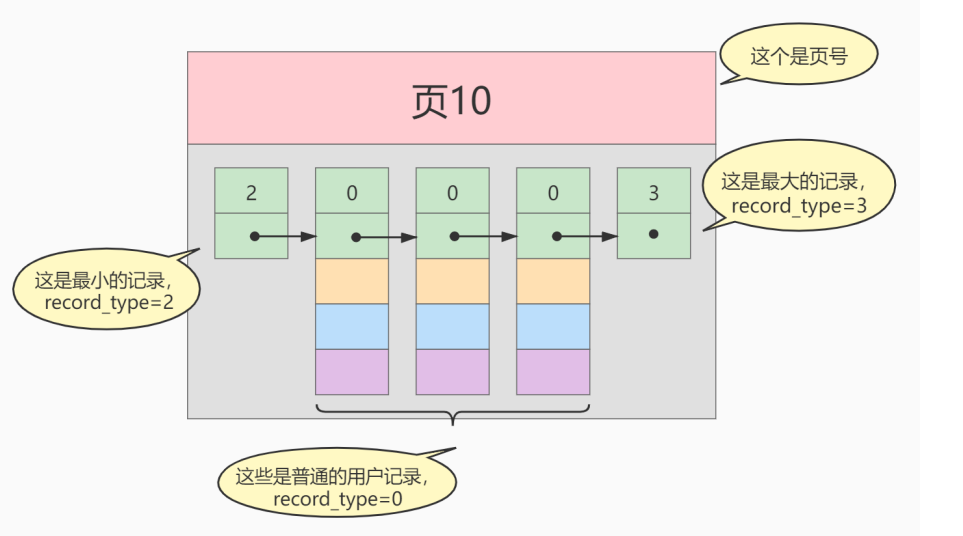
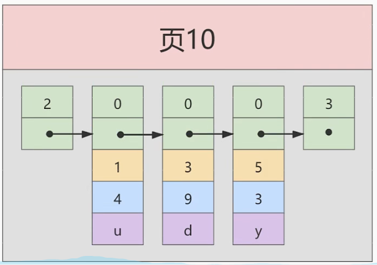
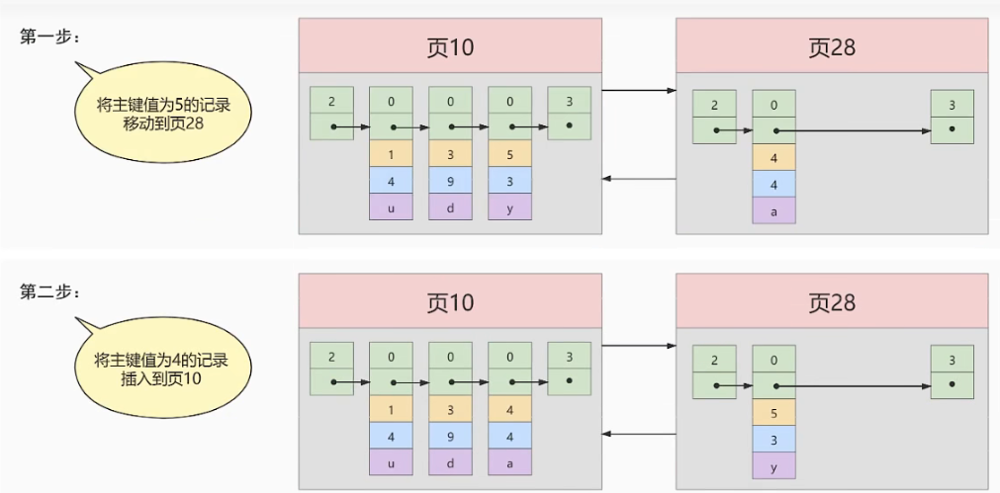
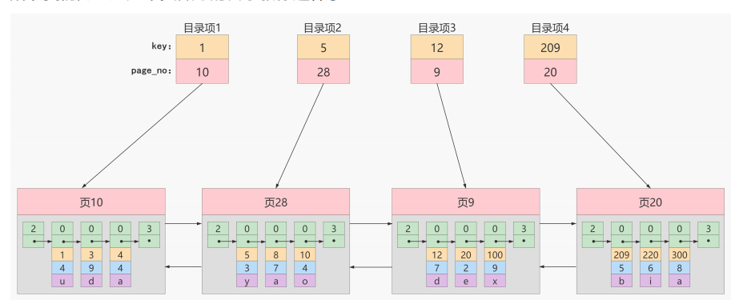

---
# 一、为什么使用索引
索引是存储引擎用于快速找到数据记录的一种数据结构，就好比一本书的目录部分，通过目录找到对应文章的页码，便可以快速定位到需要的文章。MySQL中也是一样的道理，进行数据查找时，首先查看查询条件是否命中某条索引，符合则通过索引查找相关数据，如果不符合则需要全表扫描，即需要一条条的查找记录，直到找到与条件符合的记录。


假如给数据使用 二叉树 这样的数据结构进行存储，如下图所示


对字段 Col2 添加了索引，就相当于在硬盘上为 Col2 维护了一个索引的数据结构，即这个 `二叉搜索树`。二叉搜索树的每个节点存储的是 `K,V` 结构数据，Key 是 Col2，value是该key 所在行的文件指针(地址)。比如: 该二叉搜索树的根节点是: 34,0x07。现在对 Col2 添加了索引，这时再去查找 Col2 = 89 这条记录的时候会先去查找该二叉搜索树(二叉树的遍历查找)。读 34 到内存，89 > 34， 继续找右侧数据，读到 89 到内存中， 89 == 89，找到数据之后就根据当前节点的value 快速定位到要查找的记录对应的地址。

这就是我们为什么要创建索引，目的就是为了减少磁盘IO的次数，加快查询速率。

# 二、索引概述
MySQL 官方对索引的定义为：索引(index)是帮助MySQL高效获取数据的数据结构。

索引是数据结构，简单理解为`排好序的快速查找的数据结构`，满足特定查找算法。

这些数据结构以某种方式指向数据，这样就可以在这些数据结构的基础上实现高级查找算法。

索引是在存储引擎中实现的，因此每种存储引擎的索引不一定完全性相同，并且每种存储引擎不一定支持所有索引类型。同时，存储引擎可以定义每个表的 `最大索引数` 和 `最大索引长度`。所有存储引擎支持每个表至少 16 个索引，总索引长度至少为 256 字节。有些存储疫情支持更多的索引数和更大的索引长度。

# 三、索引的优点
1. 索引类似大学图书馆建书目录，提高数据检索的效率，降低 `数据库的ID成本`，这也是创建索引的主要原因。
2. 通过创建唯一索引，可以保证数据库表中每一行数据的唯一性。
3. 在实现数据的参考完整性方面，可以加速表和表之间的连接。换句话说，对于有依赖关系的字表和父表联合查询时，可以提高查询速度。
4. 在使用分组和排序子句进行数据查询时，可以显著减少查询中分组和排序的时间，降低了CPU的消耗。

# 四、索引的缺点
1. 创建索引和维护索引需要耗费时间，并且随着数据量的增加，所耗费的时间也会增加。
2. 索引需要占磁盘空间，除了数据表占数据空间外，每个索引还要占一定的物理空间，存储在磁盘上，如果有大量的索引，索引文件就可能比数据文件更快达到最大文件限制。
3. 虽然索引大大提高了查询速度，但是会降低更新表的速度。当对表中的数据进行增加、删除、修改的时候，索引也要动态的维护，这样就降低了数据的维护速度。

# 五、InnoDB 中索引的推演

## 5.1 索引之前的查找
先看一个精确匹配的例子
```mysql
mysql> select name from user where id = 10;
```
### 1.在一个页中的查找
假设目前表中的记录比较少，所有的记录都可以被存放到一个页中，在查找记录的时候可以根据搜索条件的不同分为两种情况：
1. 以主键为搜索条件
    可以在页目录中使用 **二分法** 快速定位到对应的槽，然后再遍历该槽对应分组中的记录即可快速找到指定的记录。
2. 以其他列作为搜索条件
    因为在数据页中没有对非主键列建立所谓的页目录，所以我们无法通过二分法快速定位相应的槽。这种情况下只能从最小记录开始一次遍历单链表中的每条记录，然后对比每条记录是不是复合搜索条件。很显然，这种查找的效率是非常低效的。
### 2.在很多页中查找
在很多页中查找记录可以分为两个步骤：
1. 定位到记录所在的页。
2. 从所在的页中查找相应的记录。

在没有索引的情况下，不论是根据主键列或者其他列的值进行查找，由于我们并不能快速的定位到记录所在的页，所以只能**从第一个页**沿着**双向链表**一直往下找，在每一个页中根据我们上面的查找方式去查找指定的记录。因为要遍历所有的数据页，所以这种方式显然是 超级耗时的，如果一个表有一亿条记录呢？此时索引应运而生。


## 5.2 设计索引
首先创建一个表
```mysql
mysql> create table index_demo(
        c1 int,
        c2 int,
        c3 char(1),
        primary key (c1)
       ) ROW_FORMAT=compact;
```
这个新建的 index_demo 表，有 2个 int类型的类，1个 char(1)类型的列，而且规定了 c1列为主键，且这个表使用 compact 行格式来记录实际存储记录，这里简化 index_demo 表的行格式示意图


- `record_type`: 记录头信息的一项属性，表示记录的类型，`0`表示普通记录，`2`表示最小记录，`3`表示最大记录，`1`暂时没用过，下面说。
- `next_record`: 记录头信息的一项属性，表示下一条地址相对于本条记录的地址偏移量，我们用箭头来表名下一条记录是谁。
- `各个列的值`: 这里只记录在 index_demo 表中的三个列，分别是 c1、c2和c3.
- `其他信息`: 出了上述3中信息以外的所有信息，包括其他隐藏列的值以及记录的额外信息。

将记录格式示意图的其他信息项暂时去掉并把它竖起来的效果如下


把一些记录放到页里的示意图就是：



### 1.一个简单的索引设计方案
我们在根据某个搜索条件查找一些记录时为什么要遍历所有的数据页呢？因为各个页中的记录并没有规律，我们并不知道我们的搜索条件匹配哪些页中的记录，所以不得不依次遍历所有的数据页。所以如果我们`想快速的定位到需要查找的记录在哪些数据页`中该咋办？我们可以为快速定位记录所在的数据页而`建立一个目录`，建这个目录必须完成下边这些事

- 下一个数据页中用户记录的主键值必须大于上一个页中用户记录的主键值

    假设每个数据页最多能存放3条记录(实际上一个数据页非常大，可以存放下好多记录)。有了这个假设之后我们向 index_demo 表插入3条记录。
    ```msyql
    mysql> insert into index_demo values(1,4,'u'),(3,9.'d'),(5,3,'y');
    ```
   

    从图中可以看出来，index_demo 表中的3条记录都被插入到了编号为10的数据页中了。此时我们再来插入一条记录

    ```mysql
    msyql> insert into index_demo values(4,4,'a');
    ```
    因为页10最多只能放3条记录，所以我们不得不再分配一个新页

    .png)

    注意，新分配的数据页编号可能并部署连续的。它们只是通过维护着上一个页也下一个页的编号而建立了链表关系。另外，页10 中用户记录最大的主键值是5，而 页28 中有一条记录的主键值是4，因为 5>4，所以这就不符合下一个数据页中用户记录的主键值必须大于上一个页中用户记录的主键值的要求，所以在插入主键值为4的记录的时候需要伴随着一次记录移动，也就是把主键值为5的记录移动到页28中，然后再把主键值为4的记录插入到页10中，这个过程的示意图如下:

    

    这个过程表明了在对页中的记录进行增删改操作的过程中，我们必须通过一些诸如记录移动的操作来始终保证这个状态一直成立: 下一个数据页中用户记录的主键值必须大于上一个页中用户记录的主键值。这个过程我们称为页分裂。

- **给所有的页建立一个目录项。**
    由于数据页的编号可能是不连续的，所以在向index_demo表中插入许多条记录后，可能是这样的效果

  

    因为这些 16kb 的页在物理存储上是不连续的，所以如果想要从这么多页中根据主键值快速定位某些记录所在的页，我们需要给他们做个目录，每个页对应一个目录项，每个目录包括下边两个部分:
  - 页的用户记录中最小的主键值，我们用 key 来表示。
  - 页号，我们用 page_no 表示。
    
    所以我们为上边几个页做好的目录就像这样子

    
    
    以 页28 为例，它对应 目录项2，这个目录项中包含着该页的页号28，以及该页中用户记录的最小主键值5.我们只需要把几个目录项所在物理存储器上连续存储(比如: 数组)，就可以实现根据主键值快速查找某条记录的功能了。比如: 查找主键值为20的记录，具体查找过程分两步:
    1. 先通目录项中根据 二分法，快速确定出主键值为 20 的记录在 目录项3 中(因为 12<20<209)，它对应的页是 页9.
    2. 再根据前边说的在页中查找记录的方式去页9中定位具体的记录。
    
    至此，针对数据页做的简易目录就搞定了。这个目录有一个别名，成为索引。

### 2. InnoDB 中的索引方案
#### 2.1 迭代1次: 目录项记录的页
上边称为一个简易的索引方案，是因为我们为了在根据主键值进行查找时使用 二分法 快速定位具体的目录项而 假设 所有目录项都可以在物理存储器上 连续存储，但是这样做有几个问题:
1. InnoDB 是使用页来作为管理存储空间的基本单位，最多保证 16kb 的连续空间，而随着表中记录数量的增多，需要非常大的连续的存储空间才能把所有的目录项都放下，这对记录数量非常多的表是不现实的。
2. 我们时常会对记录进行增删，假设我们把页28中的记录都删除了，那意味着目录项2也就没有存在的必要了，这就需要把目录项2后的目录项都向前移动一下，这样牵一发而动全身的操作效率很差。

所以，我们需要一种可以灵活管理所有目录项的方式。我们发现目录项其实长得跟我们的用户记录差不多，只不过目录项中的两个列是主键和页号而已，为了和用户记录做一下区分，我们把这些用来表示目录项的记录称为目录项记录。那 InnoDB 怎么区分一条记录是普通用户还是目录项记录呢？使用记录头信息里的 record_type 属性，他们的取值代表的意思如下:
- 0: 普通的用户记录。
- 1: 目录项记录。
- 2: 最小记录。
- 3: 最大记录。

我们前边使用到的目录项放到数据页中的样子就是这样:


从图中可以看出来，我们新分配了一个编号为30的页来专门存储目录项记录。这里再次强调目录项记录和普通的用户记录的不同:
1. 目录项记录 的 record_type 值是1，而普通用户记录 的 record_type 值是0.
2. 目录项记录只有主键值和页的编号两个列，而普通的用户记录的列是用户自定义的，可能包含很多列，另外还有 InnoDB 自己添加的隐藏列。
3. 记录头信息里还有一个叫 min_rec_mask 的属性，只有在存储目录项记录 的页中的主键值最小的目录项的 min_rec_mask 值为1，其他别的记录的 min_rec_mask 值都是0。

两者用的是一样的数据页，都会为主键值生成 Page Directory(页目录)，从而按照主键值记性查找时可以使用二分法来加快查询速度。

现在以查找主键值为 20 的记录为例，根据某个主键值去查找记录的步骤可以大致拆分为以下两步:
1. 先到存储 目录项记录 的页，也就是 页30 中通过 二分法, 快速定位到对应目录项，因为 12<20<209, 所以定位到对应的记录所在的页就是 页9.
2. 再到存储用户记录的 页9 中根据 二分法，快速定位到主键值为 20 的用户记录。

#### 2.2 迭代2次: 多个目录项记录的页
虽然说目录项记录中只存储主键值和对应的页号，比用户记录需要的存储空间小多了，但是不论怎么说，一个页只有 16kb 的大小，能存放的目录项记录也是有限的，那如果表中的数据太多，以至于一个数据页不足以存放所有的目录项目录，如何处理呢？

这里我们假设一个存储目录项记录的页最多只能存放 4条 目录项记录，所以如果此时我们再向上图中插入一条主键值为 320 的用户记录的话，那么就需要分配一个新的存储目录项记录的页:


从图中可以看出来，我们插入了一条主键值为 320 的用户记录之后，需要两个新的数据页:
1. 为存储该用户记录而新生成了 页31.
2. 因为原先存储目录项记录的 页30的容量已满(前边假设只能存储4条目录项记录)，所以不得不需要一个新的 页32 来存放 页31 对应的目录项。

现在因为存储目录项记录的页不止一个，所以如果我们想根据主键值查找一条用户记录大致需要3个步骤，以查询主键值为20的记录为例:
1. 确定目录项记录页
   我们现在的存储目录项记录的页有两个，即 页30 和 页32，又因为 页30 表示的目录项的主键值的范围是[1,320), 页32 表示的目录项的主键值不小于 320，所以主键值为 20 的记录对应的目录项记录在 页 30中。
2. 通过目录项记录页确定用户记录真实所在的页
   在一个存储目录项记录的页中通过主键值定位一条目录项记录的方式说过了。
3. 在真实存储用户记录的页中定位到具体的记录。

#### 2.3 迭代3次: 目录项记录页的目录页
问题来了，在这个查询步骤的第1步中，我们需要定位存储目录项记录的页，但是这些页是不连续的，如果我们表中的数据非常多则会产生很多存储目录项记录的页，那我们怎么根据主键值快速定位一个存储目录项记录的页呢? 那就为这些存储目录项记录的页再生成一个更高级的目录，就像一个多级目录一样，大目录里嵌套小目录，小目录里才是实际的数据，所以现在各个页的示意图就是这样子的


如图，我们生成了一个存储更高级目录项的 页33，这个页中的两条记录分别代表 页30 和 页32，如果用户记录的主键值在 [1,320) 之间，则到 页30 中查找更详细的目录项记录，如果主键值 不小于320 的话，就到 页32 中查找更详细的目录项记录。

随着表中记录的增加，这个目录的层级会继续增加，如果简化一下，我们可以用下边这个图来描述它:


这个数据结构，它的名称是 `B+树`

#### B+tree
不论是存放 用户记录 的数据页，还是存放 目录项记录 的数据页，我们都把它存放到 B+树 这个数据结构中，所以我们也称这些数据页为 节点。从图中可以看出，我们的实际用户记录其实都存放在 B+树 的最底层的节点上，这些节点也被称为 叶子结点，其余用来存放目录项的节点称为 非叶子节点 或者 内节点，其中 B+树 最上边的那个节点也称为 根节点。

一个 B+树 的节点其实可以分成好多层，规定最下边的那层，也就是存放我们用户记录的那层为第0层，之后一次往上加。之前我们做了一个非常极端的假设: 存放用户记录的页，最多存放 3 条记录，存放目录项记录的页，最多存放 4条记录。其实真实环境中一个页存放的记录数是非常大的，假设所有存放用户记录的叶子节点代表的数据页可以存放100条用户记录，所有存放目录项记录的内节点代表的数据页可以存放 1000条目录项记录，那么：
- 如果 B+ 树只有1层，也就是只有一个用于存放用户记录的节点，最多能存放 100条记录。
- 如果 B+ 树有2层，最多能存放 1000*100=100000条记录。
- 如果 B+ 树有3层，最多能存放 1000*1000*100=100000000条记录。
- 如果 B+ 树有4层，最多能存放 1000*1000*1000*100=100000000000条记录。

你的表里能存放下100000000000条记录吗？所以一般情况下，我们用到的 B+树 都不会超过4层，那我们通过主键值去查找某条记录最多只需要做 4个页面内的查找(查找3个目录项页和一个用户记录页)，又因为在每个页面内有所谓的 Page Directory(页目录)，所以在页面内也可以通过 二分法 实现快速定位记录 


## 5.3 常见索引概念
索引按照物理实现方式，分为 2 中: 聚簇索引 和 非聚簇索引。我们也把 非聚簇索引 称为 耳机索引 或者叫 辅助索引。

### 5.3.1 聚簇索引
聚簇索引并不是一种单独的索引类型，而是一种数据存储方式(所有的用户记录都存储在了叶子节点)，也就是所谓的 索引即数据，数据即索引。

> 聚簇: 表示数据行和相邻的键值聚簇的存储在一次。

在数据页中，记录和记录之间是单项列表，在数据页之间是双向列表。

聚簇索引特点:
1. 使用记录主键值的大小进行记录和页的排序，这包括三个方面的含义：
   1. 页内的记录是按照主键的大小顺序排成一个单项列表。
   2. 各个存放用户记录的页，也是根据页中用户记录的主键大小顺序排成一个双向链表。
   3. 存放目录项记录的页，分为不同的层次，在同一层次中的页，也是根据页中目录项记录的主键大小排序成一个双向链表。
2. B+ 树的叶子结点存储的是完整的用户记录
   所谓完整的用户记录，就是指这个记录中存储了所有列的值(包括隐藏列)。

我们把具有这两种特性的 B+树 称为: `聚簇索引`，所有完整的用户记录都存放在这个 聚簇索引 的叶子节点处。这中聚簇索引并不需要我们在 MySQL 语句汇总显示的使用 INDEX 语句去创建， InnoDB 存储引擎会自动的为我们创建聚簇索引。

聚簇索引优点:
1. 数据访问更快，因为聚簇索引将索引和数据保存再同一个 B+ 树中，因此从聚簇索引中获取数据比 非聚簇索引更快。
2. 聚簇索引对于主键的 排序查找 和 范围查找 速度非常快。
3. 按照聚簇索引排列顺序，查询显示一定范围数据的时候，由于数据都是紧密相连的，数据库不用从多个数据块中提取数据，所以节省了大量的IO操作。

聚簇索引的缺点：
1. 插入速度严重依赖于插入顺序，按照主键的顺序插入是最快的方式，否则将会出现页分裂，严重影响性能。因此，对弈 InnoDB 表，我们一般都会定义一个自增的ID列为主键。
2. 更新主键的代价很高，因为将会导致被更新的行移动。因此，对于 InnoDB 表，我们一般定义主键为不可更新。
3. 二级索引访问需要两次索引查找，第一次找到主键值，第二次根据主键值找到行数据。

聚簇索引的限制：
1. 对于 MySQL 数据库目前只有 InnoDB 数据引擎支持聚簇索引，而 MyISAM 并不支持聚簇索引。
2. 由于数据物理存储排序方式只能有一种，所以每个 MySQL 的表只能有一个聚簇索引。一般情况下就是该表的主键。
3. 如果没有定义主键，InnoDB 会选择非空的唯一索引代替。如果没有这样的索引，InnoDB 会隐式的定义一个主键来作为聚簇索引。
4. 为了充分利用聚簇索引的聚簇特性，所以 InnoDB 表的主键列尽量选用有序的顺序id，而不建议选用无序id。比如: UUID、MD5、HASH、字符串作为主键无法保证数据的顺序增长。


### 5.3.2 二级索引(辅助索引、非聚簇索引)
上边介绍的聚簇索引只能在搜索条件是主键时才能发挥作用，因为 B+树 中的数据都是按照主键进行排序的。那如果我们想以别的列作为搜索条件该怎么办呢？肯定不能是从头到尾沿着链表依次遍历记录一遍。

我们可以多创建几棵B+树，不同的 B+树 中的数据采用不同的排序规则。比如我们用 c2列 的大小作为数据页、页中记录的排序规则，再创建一个 B+树，效果如果所示


这个 B+树 与上边介绍的聚簇索引有几处不同：
1. 使用记录 c2 列的大小进行记录和页的排序，这包括三个方面的含义：
   1. 页内的记录是按照 c2 列的大小顺序排成一个单向列表。
   2. 各个存放 用户记录的页，也是根据页中记录的 c2 列大小顺序排成一个 双向链表。
   3. 存放 目录记录的页 分为不同的层次，在同一层次中的页也是根据页中目录项记录的 c2 列大小顺序排成一个 双向链表。
2. B+树 的叶子节点存储的并不是完整的用户记录，而只是 c2列+主键 这两个列的值。
3. 目录项记录中不再是主键+页号的搭配，而变成了 c2列+页号 的搭配。

所以，如果我们现在通过 c2列 的值查找某些记录的话，就可以使用我们刚刚创建好的这个 B+树了。以查找 c2 列的值 4 的记录为例，查找过程如下：
1. 确定 目录项记录页
   根据 根页面，也就是 页44，可以快速定位到数据项记录所在的页为 页42(因为 2<4<9).
2. 通过 目录项记录页 确定用户记录真实所在的页
   在 页42中，可以快速定位到实际存储用户记录的页，但是由于 c2 列并没有唯一性约束，所以 c2 列值为 4 的记录可能分布在多个数据页中，又因为 2<4≤4, 所以确定实际存储用户记录的页在 页34和页35 中。
3. 在真实存储用户记录的页中定位到具体的记录。
    到 页34 和 页35 中定位到具体的记录。
4. 但是这个 B+树 的叶子节点中记录只存储了 c2 和 c1(也就是主键)两个列，所以我们必须再根据主键值去聚簇索引中再查找一遍完整的用户记录(回表操作)。

`回表`: 我们根据这个以 c2列大小排序的 B+树 只能确定我们要查找记录的主键值，所以如果我们想根据 c2 列的值查找到完整的用户记录的话，仍然需要到 聚簇索引 中再查一遍，这个过程称为 回表。也就是根据 c2列 的值查询一条完整的用户记录需要使用到 2颗 B+树。

问题：为什么我们还需要一次回表操作呢？直接把完整的用户记录放到叶子节点不行吗？

回答：如果把完整的用户记录放到叶子节点是可以不用回表，但是太占地方了，相当于每建立一颗B+树，都需要把所有的用户记录都再拷贝一遍，这就有点太浪费存储空间了。

因为这种按照 非主键列 建立的 B+树需要一次回表操作才可以定位到完整的用户记录，所以这种 B+树 也被称为 二级索引(secondary index), 或者 辅助索引。由于我们使用的是 c2 列的大小作为 B+树 的排序规则，所以我们也称这个 B+树 是为 c2 列建立的索引。

非聚簇索引的存在不影响数据在聚簇索引中的组织，所以一张表可以有多个非聚簇索引。


小结： 聚簇索引与非聚簇索引的原理不同，在使用上也有一些区别：
1. 聚簇索引的叶子节点，存储的就是我们的数据记录，非聚簇索引的叶子节点存储的是数据位置。非聚簇索引不会影响数据表的物理存储顺序。
2. 一个表只能有一个聚簇索引，因为只能有一种排序存储方式，但是可以有多个非聚簇索引，也就是多个索引目录提供数据检索。
3. 使用聚簇索引的时候，数据的查询效率高，但是如果对数据进行插入、删除、更新等操作，效率会比非聚簇索引低。


### 5.3.3 联合索引
我们也可以同时以多个列的大小作为排序规则，也就是同时为多个列建立索引，比方说我们想让 B+树 按照 c2和c3列 的大小记性排序，这包含了两层含义：
1. 先把各个记录和页按照 c2列 进行排序。
2. 在记录的 c2 列相同的情况下，采用 c3列 进行排序


如图所示，我们需要注意以下几个点:
1. 每个目录项记录都由 `c2、c3、页号` 这三个部分组成，各条记录先按照 c2 列的值进行排序，如果记录的 c2 列相同，则按照 c3 列的值进行排序。
2. B+树 叶子节点 处的用户记录由 c2、c3和主键c1列组成。

注意一点，以 c2和c3 列的大小为排序规则建立的 B+ 树称为 `联合索引`，本质上也是一个 二级索引。它的意思与分别为 c2和c3列 分别建立索引的表述是不同的，不同点如下：
1. 建立 **联合索引** 只会建立如上图一样的 1课B+树
2. 为 c2和c3列 分表建立索引会分别为 c2和c3列 的大小为排序规则建立 2颗B+树。

## 5.4 InnoDB 的 B+树索引的注意事项
### 5.4.1 根页面位置万年不懂动
我们前边介绍 B+树 索引的时候，为了大家理解上的方便，先把存储用户记录的叶子节点都画出来，然后接着画存储目录项记录的内节点，实际上 B+树 的形成过程是这样的:
1. 每当为某个表创建一个 B+树 索引(聚簇索引不是认为创建的，默认就有)的时候，都会为这个索引创建一个


