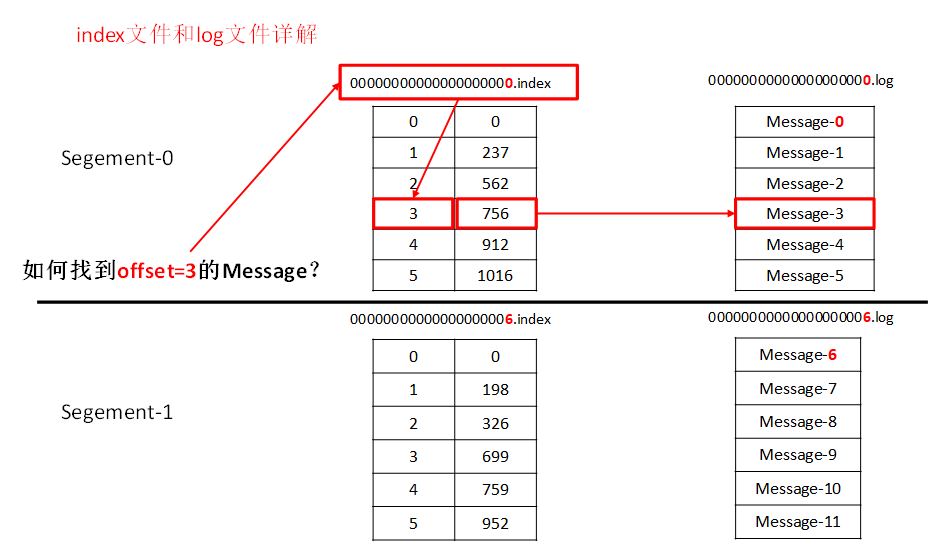

---
# 一、Kafka 是什么?
Kafka 是一个分布式的基于 `发布/订阅` 模式的消息队列, 主要应用于大数据实时处理领域.

和 Kafka 类似的产品还有 RocketMQ、RabbitMQ

# 二、Kafka 基础架构


名词解释: 
- Producer: 消息生产者, 就是向kafka broker发消息的客户端
- Consumer: 消息消费者, 向kafka broker取消息的客户端
- Consumer Group(CG): 消费者组, 由多个consumer组成。消费者组内每个消费者负责消费不同分区的数据, 一个分区只能由一个消费者消费; 消费者组之间互不影响。所有的消费者都属于某个消费者组, 即消费者组是逻辑上的一个订阅者。
- Broker: 一台kafka服务器就是一个broker。一个集群由多个broker组成。一个broker可以容纳多个topic
- Topic: 可以理解为一个队列, 生产者和消费者面向的都是一个topic
- Partition: 为了实现扩展性, 一个非常大的topic可以分布到多个broker（即服务器）上, 一个topic可以分为多个partition, 每个partition是一个有序的队列
- Replica: 副本, 为保证集群中的某个节点发生故障时, 该节点上的partition数据不丢失, 且kafka仍然能够继续工作, kafka提供了副本机制, 一个topic的每个分区都有若干个副本, 一个leader和若干个follower。
- leader: 每个分区多个副本的“主”, 生产者发送数据的对象, 以及消费者消费数据的对象都是leader。
- follower: 每个分区多个副本中的“从”, 实时从leader中同步数据, 保持和leader数据的同步。leader发生故障时, 某个follower会成为新的follower。


# 三、Kafka 工作流程和文件存储机制
在 kafka 中, 消息是以 Topic 进行分类的, 每一类的 Topic 都有对应的生产者生产消息, 有消费者消费对应 Topic 的消息, 生产和消费都是面向 Topic的

Topic 是逻辑上的概念, 但是 Partition 是物理上的概念, 每个 Partition 对应于一个 log 文件, 该 log 文件中存储的就是 生产者(producer) 生产的消息. 生产者(producer) 生产的消息会被不断**地追加到该 log 文件的末端**, 且每条数据都有自己的 offset, 消费者组中的每个消费者, 都会实时记录自己消费到了哪个 offset, 以便出错恢复时, 从上次的位置继续消费。


由于 生产者生产的消息会不断的追加到 log 文件末尾, 为防止 log 文件过大导致数据定位效率低下, kafka 采取了分片和索引机制, 就是将每个 Partition 分为多个 segment, 每个 segment 对应两个文件: `.index` 和 `.log` 文件, 这些文件位于一个文件夹下, 该文件夹的命名规则为: `topic名称-分区号`, 例如, first 这个 Topic 有三个分区, 则七对应的文件夹为 `first-0`,`first-1`,`first-2`
```bash
00000000000000000000.index
00000000000000000000.log
00000000000000170410.index
00000000000000170410.log
00000000000000239430.index
00000000000000239430.log
```

index 和 log 文件以当前 segment 的第一条消息的 offset 命名, 如下图 index 和 log 文件结构示意图


`.index` 文件存储大量的索引信息, `.log` 文件存储大量的数据, 索引文件中的元数据指向对应数据文件中 message 的物理偏移地址

# 四、Kafka 生产者


# 五、Kafka 消费者


# 六、Kafka 高效读写


# 七、Zookeeper 在 Kafka 中的作用


# 八、