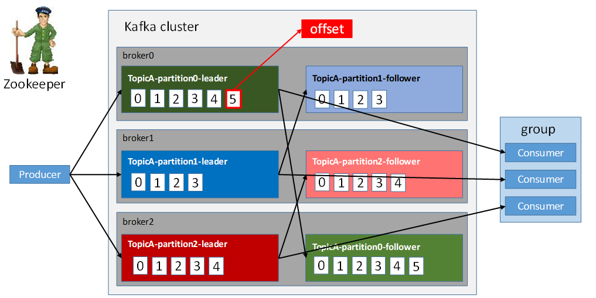

---
# 一、Kafka 是什么?
Kafka 是一个分布式的基于 `发布/订阅` 模式的消息队列, 主要应用于大数据实时处理领域.

和 Kafka 类似的产品还有 RocketMQ、RabbitMQ

# 二、Kafka 基础架构


名词解释: 
- `Producer`: 消息生产者, 就是向kafka broker发消息的客户端
- `Consumer`: 消息消费者, 向kafka broker取消息的客户端
- `Consumer Group(CG)`: 消费者组, 由多个consumer组成。消费者组内每个消费者负责消费不同分区的数据, 一个分区只能由一个消费者消费; 消费者组之间互不影响。所有的消费者都属于某个消费者组, 即消费者组是逻辑上的一个订阅者。
- `Broker`: 一台kafka服务器就是一个broker。一个集群由多个broker组成。一个broker可以容纳多个topic
- `Topic`: 可以理解为一个队列, 生产者和消费者面向的都是一个topic
- `Partition`: 为了实现扩展性, 一个非常大的topic可以分布到多个broker（即服务器）上, 一个topic可以分为多个partition, 每个partition是一个有序的队列
- `Replica`: 副本, 为保证集群中的某个节点发生故障时, 该节点上的partition数据不丢失, 且kafka仍然能够继续工作, kafka提供了副本机制, 一个topic的每个分区都有若干个副本, 一个leader和若干个follower。
- `leader`: 每个分区多个副本的“主”, 生产者发送数据的对象, 以及消费者消费数据的对象都是leader。
- `follower`: 每个分区多个副本中的“从”, 实时从leader中同步数据, 保持和leader数据的同步。leader发生故障时, 某个follower会成为新的follower。


# 三、Kafka 工作流程和文件存储机制
在 kafka 中, 消息是以 Topic 进行分类的, 每一类的 Topic 都有对应的生产者生产消息, 有消费者消费对应 Topic 的消息, 生产和消费都是面向 Topic的

Topic 是逻辑上的概念, 但是 Partition 是物理上的概念, 每个 Partition 对应于一个 log 文件, 该 log 文件中存储的就是 生产者(producer) 生产的消息. 生产者(producer) 生产的消息会被不断**地追加到该 log 文件的末端**, 且每条数据都有自己的 offset, 消费者组中的每个消费者, 都会实时记录自己消费到了哪个 offset, 以便出错恢复时, 从上次的位置继续消费。


由于 生产者生产的消息会不断的追加到 log 文件末尾, 为防止 log 文件过大导致数据定位效率低下, kafka 采取了分片和索引机制, 就是将每个 Partition 分为多个 segment, 每个 segment 对应两个文件: `.index` 和 `.log` 文件, 这些文件位于一个文件夹下, 该文件夹的命名规则为: `topic名称-分区号`, 例如, first 这个 Topic 有三个分区, 则七对应的文件夹为 `first-0`,`first-1`,`first-2`
```bash
00000000000000000000.index
00000000000000000000.log
00000000000000170410.index
00000000000000170410.log
00000000000000239430.index
00000000000000239430.log
```

index 和 log 文件以当前 segment 的第一条消息的 offset 命名, 如下图 index 和 log 文件结构示意图


`.index` 文件存储大量的索引信息, `.log` 文件存储大量的数据, 索引文件中的元数据指向对应数据文件中 message 的物理偏移地址

# 四、Kafka 生产者
## 4.1 分区策略
### 4.1.1 为什么要分区
在上面 <Kafka架构图> 中, 可以看到 TopicA有三个分区, 分别是 `partition0, partition1, partition2`
 
在 Kafka 生产消费消息的时候, 我们肯定是希望能够将数据均匀的分配到所有服务器上, 为的就是多个分区能够提供负载均衡的能力, 不同的分区能够被放置到不同的服务器上, 数据的读写操作也都是针对分区这个粒度而进行的, 这样每个节点的机器都能独立的执行各自分区的读写请求, 并且, 我们还可以通过添加新的加点机器来增加整体系统的吞吐量.

### 4.1.2 分区的策略
所谓分区策略是决定生产者将消息发送到哪个分区算法, Kafka 提供了默认的分区策略, 同时也支持自定义分区策略

有兴趣的同学可以使用 idea 创建一个maven工程, 一起看看发送消息的源码

在 pom 文件中增加如下内容:
```xml
<dependencies>
    <dependency>
        <groupId>org.apache.kafka</groupId>
        <artifactId>kafka-clients</artifactId>
        <version>0.11.0.0</version>
    </dependency>
</dependencies>
```
创建一个Java类, 内容如下:
```java
package com.kino.kafka;

import org.apache.kafka.clients.producer.*;

import java.util.Properties;
import java.util.concurrent.ExecutionException;

public class CustomProducer {

    public static void main(String[] args) throws ExecutionException, InterruptedException {
        Properties props = new Properties();
        props.put("bootstrap.servers", "hadoop102:9092");//kafka集群，broker-list
        props.put("acks", "all");
        props.put("retries", 1);//重试次数
        props.put("batch.size", 16384);//批次大小
        props.put("linger.ms", 1);//等待时间
        props.put("buffer.memory", 33554432);//RecordAccumulator缓冲区大小
        props.put("key.serializer", "org.apache.kafka.common.serialization.StringSerializer");
        props.put("value.serializer", "org.apache.kafka.common.serialization.StringSerializer");

        Producer<String, String> producer = new KafkaProducer<>(props);
        for (int i = 0; i < 100; i++) {
            producer.send(new ProducerRecord<String, String>("first", Integer.toString(i), Integer.toString(i)));
        }
        producer.close();
    }
}
```
进入 `new ProducerRecord` 方法内部
```java
/**
 * Create a record to be sent to Kafka
 * 
 * @param topic The topic the record will be appended to
 * @param key The key that will be included in the record
 * @param value The record contents
 */
public ProducerRecord(String topic, K key, V value) {
    this(topic, null, null, key, value, null);
}
```
可以看到我们往Kafka 发送消息调用的 `send` 方法, 里面的 `new ProducerRecord` 是一个重载方法, 实际上会调用:
```java
/**
 * Creates a record with a specified timestamp to be sent to a specified topic and partition
 * 
 * @param topic The topic the record will be appended to
 * @param partition The partition to which the record should be sent
 * @param timestamp The timestamp of the record
 * @param key The key that will be included in the record
 * @param value The record contents
 * @param headers the headers that will be included in the record
 */
public ProducerRecord(String topic, Integer partition, Long timestamp, K key, V value, Iterable<Header> headers) {
    if (topic == null)
        throw new IllegalArgumentException("Topic cannot be null.");
    if (timestamp != null && timestamp < 0)
        throw new IllegalArgumentException(
                String.format("Invalid timestamp: %d. Timestamp should always be non-negative or null.", timestamp));
    if (partition != null && partition < 0)
        throw new IllegalArgumentException(
                String.format("Invalid partition: %d. Partition number should always be non-negative or null.", partition));
    this.topic = topic;
    this.partition = partition;
    this.key = key;
    this.value = value;
    this.timestamp = timestamp;
    this.headers = new RecordHeaders(headers);
}
```
该方法为 最终被调用的方法, 其有 6 个参数:
- `topic`: 发送到这个主题中
- `partition`: 发送到这个分区中
- `timestamp`: 发送的记录的时间戳
- `key`: 对应的秘钥
- `value`: 发送过去的记录
- `headers`: 一条消息的头部信息

在看看这个方法的所有重载方法有哪些, 最少传入哪几个值(发送一条消息必须传入的参数)


可以看见, 这里仅需要一个 topic 名称和 value 即可向 Kafka 发送一条消息

这里 Kafka 的分区分配策略如下:
1. 必须制定 Topic 和 value, 否则报错
2. 如果指明了 partition 的情况下, 直接将知名的值作为 partition 值;
3. 如果没有指明 partition, 但是指定了 Key, 则将 Key 的 hash 值与 Topic 的 partition 取余得到 partition 值;
4. 如果没有指明 partition, 也没有指定 Key, 则第一次调用的时候随机生成一个整数, 将这个值与 Topic 可用的 partition 总数取余得到 partition 值, 也就是 round-robin 算法

## 4.2 数据可靠行保证

## 4.3 Exactly Once 语义

# 五、Kafka 消费者


# 六、Kafka 高效读写


# 七、Zookeeper 在 Kafka 中的作用


# 八、